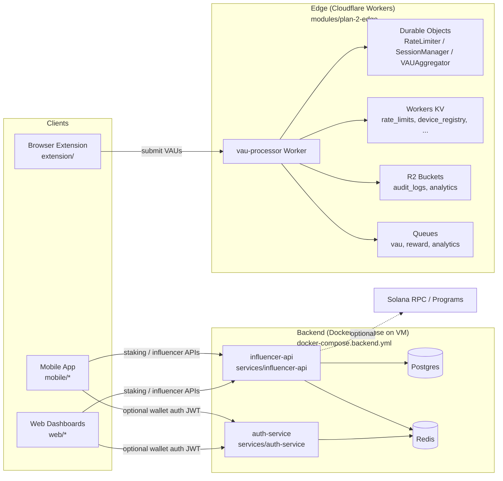
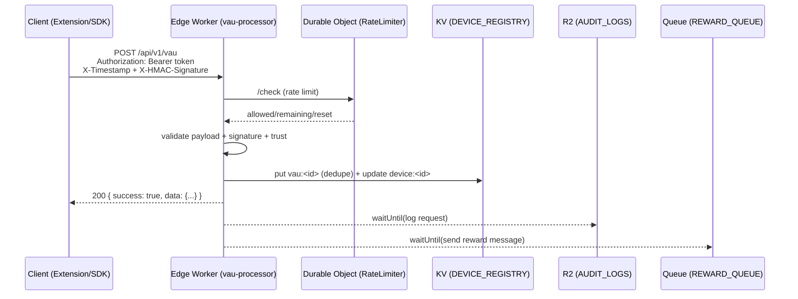
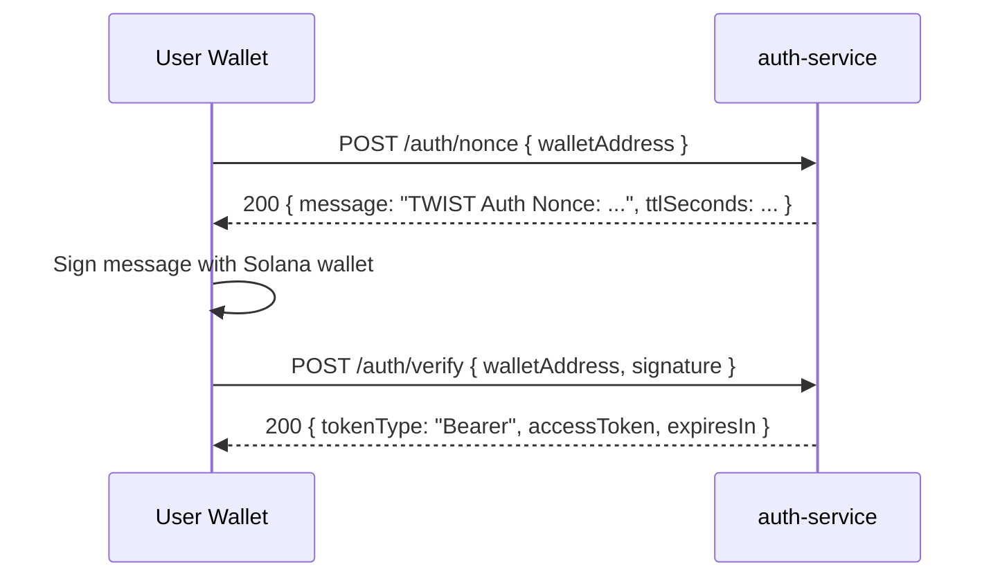
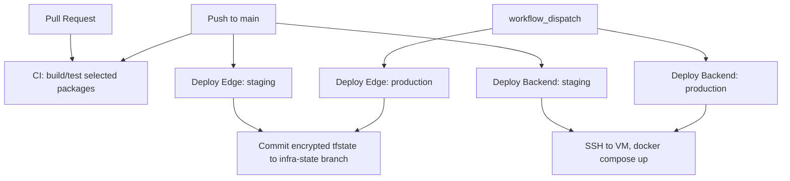

# TWIST

Monorepo for TWIST edge (Cloudflare Workers) plus backend services for an influencer staking system.

[](https://github.com/gary322/twist/actions/workflows/ci.yml)

## Contents

- [What Is TWIST?](#what-is-twist)
- [What TWIST Can Do](#what-twist-can-do)
- [What This Repo Ships Today](#what-this-repo-ships-today)
- [System Architecture](#system-architecture)
- [Repo Layout](#repo-layout)
- [Quickstart (Local Dev)](#quickstart-local-dev)
- [Edge (Cloudflare Workers + Terraform)](#edge-cloudflare-workers--terraform)
- [Backend (Docker Compose on a VM)](#backend-docker-compose-on-a-vm)
- [Frontends (Web, Extension, Mobile)](#frontends-web-extension-mobile)
- [Blockchain Workspace](#blockchain-workspace)
- [CI/CD](#cicd)
- [Operations](#operations)
- [Security](#security)
- [Troubleshooting](#troubleshooting)

## What Is TWIST?

TWIST is an attention and incentives platform. Client apps (extension/web/mobile/SDKs) emit **Verified Attention Units (VAUs)**, which are validated at the edge (Cloudflare Workers) and turned into reward and analytics events. A backend API then powers influencer pools, referral links, click/conversion attribution, and payout workflows.

Core primitives:

- **VAU**: a signed attention event `{ userId, deviceId, siteId, timestamp, payload, ... }` submitted to the edge.
- **Device trust**: a score derived from device history (and optional attestations) used to dampen fraud and scale rewards.
- **Influencer staking pools**: pool discovery + stake/unstake/claim flows persisted in Postgres, with optional on-chain settlement (currently scaffolded).
- **Referral links + attribution**: link generation, click tracking, conversion events, and aggregated analytics.

This repo is a monorepo: the edge path is production-deployed via Terraform; the backend currently runs as Node services deployed via GitHub Actions to a VM with Docker Compose.

## What TWIST Can Do

What’s implemented in the codebase today (with production hardening still required for some areas):

- **Collect VAUs at the edge**: HMAC-signed ingestion, rate limiting via Durable Objects, dedupe + device registry in KV, audit logging to R2, and reward/analytics messages enqueued to Workers Queues (`modules/plan-2-edge/`).
- **Wallet auth (Solana)**: nonce issuance + signature verification to mint JWTs, plus `/health`, `/ready`, and Prometheus `/metrics` (`services/auth-service/`).
- **Influencer + staking API**: influencer registration + email verification, staking pool search and stake/unstake/claim endpoints, Postgres persistence, Redis-backed caching and background jobs, and real-time updates via Socket.IO gateways (`services/influencer-api/`).
- **Referral links + attribution**: referral link generation, click tracking, conversion events, and analytics endpoints (implemented in backend, with some product behaviors still simplified).

What is present but not production-complete yet:

- **End-to-end auth standardization**: JWT claims/expectations are not fully aligned between `auth-service` and `influencer-api`, and some endpoints still accept `userId`/`wallet` in request bodies.
- **On-chain settlement**: Solana integration exists as scaffolding in backend code; some staking flows still generate mock transaction ids unless you wire the programs end-to-end.
- **Frontend deployment**: web/extension/mobile apps exist but are not wired into the deploy workflows in this repo.

## What This Repo Ships Today

The GitHub Actions pipelines in this repo actively build and deploy these paths:

- Edge: `modules/plan-2-edge/` (Cloudflare Workers + Terraform).
- Backend services: `services/auth-service/` and `services/influencer-api/` (Docker Compose on a VM).
- Shared packages: `packages/messages/` and `packages/blockchain-sdk/` (built as local deps).

Other directories (browser extension, dashboards, Solana programs, various `modules/plan-*` packages, Kubernetes manifests) are present in the repo but are not currently wired into the production deploy workflows.

## System Architecture



Notes:

- Edge is deployed via Terraform and only routes the public VAU/health/metrics endpoints by default.
- Backend deploy is Docker Compose over SSH to a VM.
- Backend auth is currently split across services and not fully consolidated (JWT claims/expectations differ). Treat the auth-service as a standalone wallet-auth component that you must integrate with the influencer API before production use.
- Some Solana integration is scaffolded in backend code. Several flows still use mock transaction ids; treat chain integration as "in progress" unless you have verified it end-to-end in your environment.

## Repo Layout

Canonical production paths:

- `modules/plan-2-edge/`: Edge workers + durable objects + Terraform (Cloudflare).
- `services/`: Backend services (auth + influencer API).
- `packages/`: Shared TypeScript packages consumed by backend.
- `docker-compose.backend.yml`: Production-like backend compose (auth + influencer API + Postgres + Redis).

Major non-canonical / not-in-pipeline paths:

- `twist-blockchain/`: Anchor workspace with Solana programs, bots, and an SDK.
- `extension/`: Browser extension (webpack).
- `web/`: Web dashboards (Vite/React).
- `mobile/`: Mobile app (Expo/React Native).
- `edge-workers/`: Standalone worker prototype (not used by Terraform deploy).
- `k8s/`, `kubernetes/`, `docker/production/`: Legacy infra manifests not used by current workflows.
- `modules/plan-*`: Additional modules/prototypes not currently deployed by default.

## Quickstart (Local Dev)

### Prereqs

- Node.js 20 (matches CI)
- Docker + Compose plugin

### Backend (recommended)

Run the backend stack locally with Postgres + Redis:

```bash
cp .env.backend.example .env.backend
# edit .env.backend and set strong secrets

docker compose --env-file .env.backend -f docker-compose.backend.yml up -d --build

curl -fsS http://localhost:3001/health | jq .
curl -fsS http://localhost:3003/health | jq .
```

Ports (default):

- `auth-service`: `http://localhost:3001`
- `influencer-api`: `http://localhost:3003` (mapped from container port `3000`)
- Postgres: `localhost:5432`
- Redis: `localhost:6379`

### Edge (tests + local dev)

Unit tests/build:

```bash
cd modules/plan-2-edge
npm ci
npm run build
npm test
```

Local `wrangler dev` can run the worker, but full fidelity requires Cloudflare bindings (KV, R2, Queues, Durable Objects). The production deploy uses Terraform (not wrangler).

## Edge (Cloudflare Workers + Terraform)

Path: `modules/plan-2-edge/`

### What gets deployed

Terraform (`modules/plan-2-edge/terraform/`) currently bundles and deploys:

- `vau-processor` worker (routed publicly)
- `durable-objects` worker (defines DO classes; referenced by `vau-processor`)
- `security-worker` (deployed but not routed by default)

Public routes (see `modules/plan-2-edge/terraform/main.tf`):

- `https://<api_domain>/api/v1/vau` and `.../api/v1/vau/batch`
- `https://<api_domain>/health`
- `https://<api_domain>/metrics`

### VAU submission flow



Auth for VAU endpoint (`modules/plan-2-edge/workers/vau-processor/src/middleware/auth.ts`):

- `Authorization: Bearer <token>` is required.
- For `ENVIRONMENT=development`, token `test-token` is accepted without HMAC.
- Otherwise the request must also include:
  - `X-Timestamp` (ms since epoch, within +/- 5 minutes)
  - `X-HMAC-Signature` computed over:
    - `<METHOD>\n<PATH>\n<TIMESTAMP>\n<BODY>`
  - Signature secret is `HMAC_SECRET` (Terraform binding: `TF_VAR_hmac_secret`).

Rate limiting (`modules/plan-2-edge/workers/vau-processor/src/middleware/rateLimit.ts`):

- Enforced via the `RateLimiter` Durable Object.
- Adds `X-RateLimit-*` headers to responses.

### Environments and Terraform state

Terraform vars are in:

- `modules/plan-2-edge/terraform/environments/staging/terraform.tfvars`
- `modules/plan-2-edge/terraform/environments/production/terraform.tfvars`

GitHub Actions deploy workflows store encrypted Terraform state in the `infra-state` branch:

- State file is encrypted with `EDGE_TFSTATE_PASSPHRASE`.
- Workflows read/write `.infra-state/edge/<env>/terraform.tfstate.enc`.

## Backend (Docker Compose on a VM)

Canonical path: `services/*`

Production-like compose: `docker-compose.backend.yml`

VM runbook (free tier): `docs/operations/backend_oracle_always_free.md`

### Services

#### `auth-service` (Express)

Path: `services/auth-service/`

Responsibilities:

- Issues JWTs after verifying a Solana wallet signature over a one-time nonce.
- Maintains a nonce store (in-memory or Redis-backed).
- Rate limits globally and per-IP.
- Exposes Prometheus metrics.

Key endpoints:

- `GET /health` (liveness)
- `GET /ready` (checks nonce store / Redis)
- `GET /metrics` (Prometheus)
- `POST /auth/nonce` -> returns `{ message, nonce }` to sign
- `POST /auth/verify` -> verifies signature and returns `{ accessToken }`

Wallet auth handshake:



Runtime config (see `docker-compose.backend.yml` and `services/auth-service/src/config.ts`):

- Required: `JWT_SECRET`
- Recommended: `REDIS_URL` (enables Redis-backed nonce store + better rate limiting)
- CORS: `ALLOWED_ORIGINS` (comma-separated)

#### `influencer-api` (NestJS)

Path: `services/influencer-api/`

Responsibilities (high level):

- Influencer registration/profile management.
- Staking pool discovery and staking actions (persisted in Postgres).
- Redis-backed caching and background processing (Bull).
- Optional Solana program integration scaffolding (Anchor client).

Key endpoints (non-exhaustive; see controllers under `services/influencer-api/src/controllers/`):

- `GET /health` (liveness)
- `GET /ready` (checks DB + Redis)
- `GET /staking/search`
- `GET /staking/influencer/:influencerId`
- `POST /staking/stake`
- `POST /staking/unstake`
- `POST /staking/claim`
- `POST /influencers/register`
- `PUT /influencers/:influencerId/profile` (JWT-protected)

Swagger docs:

- Enabled only when `NODE_ENV != production`.
- Path: `GET /api/docs`

Important production note:

- Several staking flows currently generate mock transaction ids (see comments in `services/influencer-api/src/services/staking.service.ts`). Treat on-chain execution as incomplete unless you have verified otherwise.
- Authentication is not yet consistently enforced across all controllers. Some endpoints are unguarded today; production hardening should standardize JWT issuance/claims and require auth where appropriate.

### Data stores

The compose stack includes:

- Postgres 15 (data volume: `postgres_data`)
- Redis 7 (data volume: `redis_data`, password required)

## Frontends (Web, Extension, Mobile)

These are not currently deployed by the repo's production workflows, but they are present:

- Browser extension (webpack): `extension/`
  - `cd extension && npm ci && npm run build:chrome`
- Influencer dashboard (Vite/React): `web/influencer-dashboard/`
  - `cd web/influencer-dashboard && npm ci && npm run dev`
- Mobile app (Expo): `mobile/twist-staking/`
  - `cd mobile/twist-staking && npm install && npm run start`

## Blockchain Workspace

Path: `twist-blockchain/`

This directory contains an Anchor/Rust workspace with multiple Solana programs:

- `twist-blockchain/programs/twist-token`
- `twist-blockchain/programs/staking`
- `twist-blockchain/programs/treasury`
- `twist-blockchain/programs/vesting`
- `twist-blockchain/programs/bridge`
- `twist-blockchain/programs/influencer-staking`
- `twist-blockchain/programs/bond-pool-factory`
- `twist-blockchain/programs/vau-processor`

It also includes bots and an SDK under `twist-blockchain/bots/` and `twist-blockchain/sdk/`.

This workspace is not currently built in GitHub Actions CI in this repo.

## CI/CD

CI workflow: `.github/workflows/ci.yml`

Current CI jobs:

- `modules/plan-2-edge`: `npm ci`, build, unit tests
- `packages/messages`: build
- `packages/blockchain-sdk`: build
- `services/auth-service`: build
- `services/influencer-api`: builds local deps + build

Deploy workflows:

- Edge staging: `.github/workflows/deploy-edge-staging.yml` (auto on `main` changes in edge path)
- Edge production: `.github/workflows/deploy-edge-production.yml` (manual)
- Backend staging: `.github/workflows/deploy-backend-staging.yml` (auto on backend changes)
- Backend production: `.github/workflows/deploy-backend-production.yml` (manual)



### Required GitHub Environment secrets

Secrets are environment-scoped: set them in both GitHub Environments `staging` and `production`.

Edge deploy secrets:

- `CLOUDFLARE_API_TOKEN`
- `CLOUDFLARE_ACCOUNT_ID`
- `EDGE_HMAC_SECRET`
- `EDGE_TFSTATE_PASSPHRASE`
- `SOLANA_RPC_ENDPOINT` (currently bound; worker may not use it yet)
- `TWIST_PROGRAM_ID` (currently bound; worker may not use it yet)

Backend deploy secrets:

- `BACKEND_DEPLOY_HOST`
- `BACKEND_DEPLOY_USER`
- `BACKEND_DEPLOY_PATH`
- `DEPLOY_SSH_PRIVATE_KEY`
- `BACKEND_DB_PASSWORD`
- `BACKEND_REDIS_PASSWORD`
- `BACKEND_JWT_SECRET`

Optional backend secrets:

- `BACKEND_DEPLOY_PORT` (default `22`)
- `BACKEND_DEPLOY_KNOWN_HOSTS` (recommended to pin host key)
- `BACKEND_DB_USERNAME` (default `twist`)
- `BACKEND_DB_NAME` (default `twist_influencer`)
- `BACKEND_ALLOWED_ORIGINS`
- `BACKEND_WALLET_PRIVATE_KEY` (enables Solana client in influencer API)
- `SOLANA_RPC_ENDPOINT`, `TWIST_PROGRAM_ID` (passed through to backend as `SOLANA_RPC_URL` / `STAKING_PROGRAM_ID`)

Backend deploy SSH public keys:

- `docs/operations/backend_deploy_ssh_keys.md`

## Operations

- Backend VM runbook: `docs/operations/backend_oracle_always_free.md`
- Backend deploy SSH keys: `docs/operations/backend_deploy_ssh_keys.md`
- Edge ops runbook: `modules/plan-2-edge/OPERATIONS.md`
- Edge runbook: `modules/plan-2-edge/monitoring/runbooks/high-error-rate.md`

## Security

- Secret scanning (Gitleaks): `.github/workflows/secret-scan.yml`
- Static analysis (CodeQL): `.github/workflows/codeql.yml`
- Dependency updates (Dependabot): `.github/dependabot.yml`

## Troubleshooting

### macOS + iCloud Drive placeholders

If this repo lives in iCloud Drive and macOS has Optimize Mac Storage enabled, "dataless" placeholders can break git/build tooling.

- Check: `bash scripts/icloud/check.sh`
- Materialize (best-effort): `bash scripts/icloud/materialize.sh`
- More context: `docs/dev/icloud.md`
