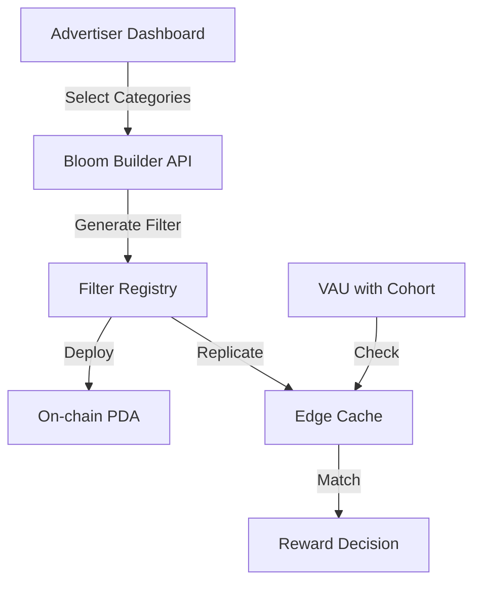

# Bloom Filter Service (`bloom_filter_service.rs`)

Language: Rust 1.74  •  Binary: `ahee-bloom-filter`  •  Runs on: Edge Workers & On-chain

---
## 1. Purpose
Pre-computes and maintains bloom filters that allow advertisers to target specific interest cohorts without revealing which exact categories they're targeting or which cohorts users belong to. Enables O(1) privacy-preserving membership checks both on-chain and at edge.

---
## 2. System Architecture


---
## 3. Bloom Filter Design

### 3.1 Parameters
```rust
pub const FILTER_BITS: usize = 2048;      // 256 bytes
pub const NUM_HASH_FUNCTIONS: usize = 3;  // Optimal for ~100 items
pub const FALSE_POSITIVE_RATE: f64 = 0.01; // 1% acceptable

pub struct CohortBloomFilter {
    bits: BitVec<u8>,           // Packed bit array
    num_hashes: u8,             // Number of hash functions
    seed: u32,                  // For deterministic hashing
    campaign_id: [u8; 32],      // Links to campaign
    created_at: i64,            // Unix timestamp
}
```

### 3.2 Hash Function Selection
```rust
// Use xxHash3 with different seeds for speed
fn hash_cohort(cohort_hash: &[u8; 32], index: u8, seed: u32) -> usize {
    let mut hasher = XxHash3::with_seed(seed.wrapping_add(index as u32));
    hasher.write(cohort_hash);
    (hasher.finish() as usize) % FILTER_BITS
}
```

---
## 4. Filter Generation

### 4.1 Category to Cohort Mapping
```rust
// Pre-compute all possible cohorts for given categories
fn generate_target_cohorts(categories: &[u16]) -> Vec<[u8; 32]> {
    let mut cohorts = Vec::new();
    
    // Single category cohorts
    for &cat in categories {
        cohorts.push(hash_cohort_claim(&[cat], CURRENT_DAY));
    }
    
    // Two category combinations
    for i in 0..categories.len() {
        for j in i+1..categories.len() {
            let mut cats = vec![categories[i], categories[j]];
            cats.sort();
            cohorts.push(hash_cohort_claim(&cats, CURRENT_DAY));
        }
    }
    
    // Three category combinations
    for i in 0..categories.len() {
        for j in i+1..categories.len() {
            for k in j+1..categories.len() {
                let mut cats = vec![categories[i], categories[j], categories[k]];
                cats.sort();
                cohorts.push(hash_cohort_claim(&cats, CURRENT_DAY));
            }
        }
    }
    
    cohorts
}
```

### 4.2 Filter Construction
```rust
impl CohortBloomFilter {
    pub fn new(target_categories: &[u16], campaign_id: [u8; 32]) -> Self {
        let mut filter = Self {
            bits: bitvec![u8, Lsb0; 0; FILTER_BITS],
            num_hashes: NUM_HASH_FUNCTIONS as u8,
            seed: thread_rng().gen(),
            campaign_id,
            created_at: SystemTime::now()
                .duration_since(UNIX_EPOCH)
                .unwrap()
                .as_secs() as i64,
        };
        
        // Add all target cohorts
        let cohorts = generate_target_cohorts(target_categories);
        for cohort_hash in cohorts {
            filter.insert(&cohort_hash);
        }
        
        filter
    }
    
    pub fn insert(&mut self, cohort_hash: &[u8; 32]) {
        for i in 0..self.num_hashes {
            let bit_index = hash_cohort(cohort_hash, i, self.seed);
            self.bits.set(bit_index, true);
        }
    }
    
    pub fn contains(&self, cohort_hash: &[u8; 32]) -> bool {
        for i in 0..self.num_hashes {
            let bit_index = hash_cohort(cohort_hash, i, self.seed);
            if !self.bits[bit_index] {
                return false;
            }
        }
        true
    }
}
```

---
## 5. On-Chain Storage

### 5.1 PDA Structure
```rust
// Solana program account layout
#[account]
pub struct CampaignFilter {
    pub campaign_id: [u8; 32],
    pub filter_bytes: [u8; 256],  // Packed bloom filter
    pub num_hashes: u8,
    pub seed: u32,
    pub owner: Pubkey,
    pub created_at: i64,
    pub expires_at: i64,
}

// PDA seeds: ["filter", campaign_id]
```

### 5.2 Deployment Instruction
```rust
pub fn deploy_filter(
    ctx: Context<DeployFilter>,
    campaign_id: [u8; 32],
    filter_data: FilterData,
) -> Result<()> {
    let filter = &mut ctx.accounts.filter;
    
    require!(
        filter_data.filter_bytes.len() == 256,
        ErrorCode::InvalidFilterSize
    );
    
    filter.campaign_id = campaign_id;
    filter.filter_bytes = filter_data.filter_bytes;
    filter.num_hashes = filter_data.num_hashes;
    filter.seed = filter_data.seed;
    filter.owner = ctx.accounts.owner.key();
    filter.created_at = Clock::get()?.unix_timestamp;
    filter.expires_at = filter.created_at + FILTER_LIFETIME;
    
    Ok(())
}
```

---
## 6. Edge Worker Integration

### 6.1 Filter Cache
```typescript
// Cloudflare KV storage
interface FilterCache {
    campaign_id: string;
    filter_bytes: Uint8Array;
    num_hashes: number;
    seed: number;
    expires_at: number;
}

class BloomFilterClient {
    private kv: KVNamespace;
    
    async getFilter(campaignId: string): Promise<CohortBloomFilter | null> {
        const cached = await this.kv.get<FilterCache>(
            `filter:${campaignId}`, 
            'json'
        );
        
        if (!cached || Date.now() > cached.expires_at * 1000) {
            // Fetch from chain if expired
            return await this.fetchFromChain(campaignId);
        }
        
        return new CohortBloomFilter(cached);
    }
    
    async checkMembership(
        cohortHash: string, 
        campaignId: string
    ): Promise<boolean> {
        const filter = await this.getFilter(campaignId);
        if (!filter) return false;
        
        return filter.contains(Buffer.from(cohortHash, 'hex'));
    }
}
```

### 6.2 VAU Processing Addition
```typescript
// Edge worker VAU handler patch
async function processVAU(vau: VAUPacket, campaign?: string) {
    // ... existing validation ...
    
    if (vau.cohort_hash && campaign) {
        const bloomClient = new BloomFilterClient(env.FILTER_KV);
        const matches = await bloomClient.checkMembership(
            vau.cohort_hash,
            campaign
        );
        
        if (matches) {
            // Route to campaign-specific pot
            vau.funding_source = `campaign:${campaign}`;
        } else {
            // Default to global explorer pot
            vau.funding_source = 'explorer';
        }
    }
    
    // ... forward to aggregator ...
}
```

---
## 7. Privacy Analysis

### 7.1 Information Hiding
```
Advertiser knows: "User matches my targeting"
Advertiser doesn't know: Which specific categories the user has

User knows: Nothing (bloom filter is opaque)
Protocol knows: Cohort hash (but not categories due to hashing)
```

### 7.2 False Positive Analysis
```
Expected false positives = 0.01 × total_cohorts
With 10,000 possible cohorts:
- ~100 false matches
- Advertiser pays for slight over-delivery
- Users occasionally get non-relevant rewards (bonus)
```

### 7.3 Filter Update Strategy
- Generate new filter daily (covers rotating cohorts)
- Keep 3 days of filters active (yesterday, today, tomorrow)
- Total storage: 3 × 256 bytes per campaign

---
## 8. Dashboard API

### 8.1 Filter Generation Endpoint
```rust
#[post("/api/filters/generate")]
async fn generate_filter(
    Json(request): Json<GenerateFilterRequest>,
    auth: BearerAuth,
) -> Result<Json<FilterResponse>> {
    // Validate ownership
    let campaign = get_campaign(request.campaign_id, auth.wallet)?;
    
    // Check category limits
    if request.categories.len() > 20 {
        return Err(Error::TooManyCategories);
    }
    
    // Generate filter
    let filter = CohortBloomFilter::new(
        &request.categories,
        request.campaign_id
    );
    
    // Deploy to chain
    let tx_hash = deploy_to_chain(filter.clone()).await?;
    
    // Cache at edge
    propagate_to_edge(filter.clone()).await?;
    
    Ok(Json(FilterResponse {
        filter_id: hex::encode(campaign.id),
        tx_hash,
        stats: FilterStats {
            num_categories: request.categories.len(),
            estimated_reach: estimate_reach(&request.categories),
            false_positive_rate: 0.01,
        }
    }))
}
```

### 8.2 Analytics Endpoint
```rust
#[get("/api/filters/:id/stats")]
async fn get_filter_stats(
    Path(filter_id): Path<String>,
    auth: BearerAuth,
) -> Result<Json<FilterAnalytics>> {
    let stats = query_stats(&filter_id).await?;
    
    Ok(Json(FilterAnalytics {
        total_matches: stats.match_count,
        false_positive_estimate: stats.match_count * 0.01,
        categories_coverage: stats.category_histogram,
        daily_trend: stats.daily_matches,
    }))
}
```

---
## 9. Performance Optimization

### 9.1 Bit Packing
```rust
// Use SIMD for parallel bit checks
#[cfg(target_arch = "x86_64")]
use std::arch::x86_64::*;

unsafe fn contains_simd(&self, cohort_hash: &[u8; 32]) -> bool {
    let mut indices = [0usize; 4];
    for i in 0..self.num_hashes {
        indices[i] = hash_cohort(cohort_hash, i as u8, self.seed);
    }
    
    // Load 256-bit vector
    let filter_vec = _mm256_loadu_si256(
        self.bits.as_raw_slice().as_ptr() as *const __m256i
    );
    
    // Check all bits in parallel
    // ... SIMD implementation ...
}
```

### 9.2 Edge Caching Strategy
- Pre-warm cache for top 1000 campaigns
- LRU eviction for long-tail
- Compress filters with zstd (256B → ~180B)

---
## 10. Testing

### 10.1 Unit Tests
```rust
#[test]
fn test_no_false_negatives() {
    let categories = vec![7, 42, 123];
    let filter = CohortBloomFilter::new(&categories, [0; 32]);
    
    // Test all possible cohorts that should match
    let cohorts = generate_target_cohorts(&categories);
    for cohort in cohorts {
        assert!(filter.contains(&cohort));
    }
}

#[test]
fn test_false_positive_rate() {
    let filter = CohortBloomFilter::new(&[1, 2, 3], [0; 32]);
    let mut false_positives = 0;
    
    // Test 10,000 random cohorts
    for _ in 0..10_000 {
        let random_cohort = rand::random::<[u8; 32]>();
        if filter.contains(&random_cohort) {
            false_positives += 1;
        }
    }
    
    let rate = false_positives as f64 / 10_000.0;
    assert!(rate < 0.02); // Within 2x expected
}
```

### 10.2 Integration Tests
```typescript
describe('Bloom Filter E2E', () => {
    it('should route targeted traffic correctly', async () => {
        // Deploy filter for Sports (7) + Shopping (12)
        const filter = await deployFilter([7, 12], campaignId);
        
        // User with cohort [7, 12, 18] should match
        const vau = createVAU({
            cohort_hash: hashCohort([7, 12, 18])
        });
        
        const result = await processVAU(vau, campaignId);
        expect(result.funding_source).toBe(`campaign:${campaignId}`);
    });
});
```

---
## 11. Monitoring

Metrics tracked:
- Filter generation time
- Cache hit rate
- Membership check latency (p50, p99)
- False positive rate (estimated)
- Storage usage per campaign

Alerts:
- Cache miss rate > 10%
- Check latency > 5ms p99
- Filter expiration failures

---
## 12. Security Considerations

| Threat | Mitigation |
|--------|-----------|
| Filter manipulation | On-chain storage with owner check |
| Cache poisoning | Signed filter hashes |
| Timing attacks | Constant-time bit checks |
| Cohort enumeration | 2^256 search space |
| Campaign hijacking | Campaign ID in PDA seed |

---
## 13. Cost Analysis

### 13.1 On-chain
- Deployment: ~50k CU (one-time)
- Storage: 256 bytes × 3 days = 768 bytes
- Rent: ~0.002 SOL per campaign

### 13.2 Edge
- Storage: 180B compressed × 10k campaigns = 1.8MB
- Compute: <0.1ms per check
- Bandwidth: Negligible (cached)

### 13.3 Total Cost
~$0.10 per campaign per month

---
End of file 