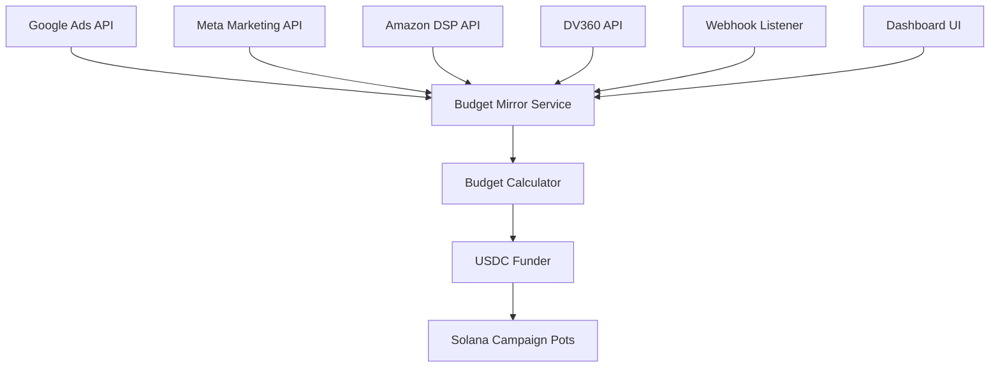

# Budget Mirror Service (`budget_mirror_service.py`)

Language: Python 3.11  •  Schedule: Every hour + webhook-triggered  •  Integrations: Google Ads, Meta, Amazon DSP

---
## 1. Purpose
Bridges traditional ad platform workflows with AHEE's on-chain payment system by automatically syncing campaign budgets from Google Ads, DV360, Meta Ads Manager, and Amazon DSP to corresponding Solana campaign pots. Allows media buyers to keep using familiar interfaces while benefiting from AHEE's fraud-proof settlement.

---
## 2. Architecture Overview


---
## 3. Platform Integrations

### 3.1 Google Ads Integration
```python
from google.ads.googleads.client import GoogleAdsClient
from google.ads.googleads.errors import GoogleAdsException
import asyncio
from decimal import Decimal

class GoogleAdsConnector:
    def __init__(self, customer_id: str, credentials_path: str):
        self.customer_id = customer_id
        self.client = GoogleAdsClient.load_from_storage(credentials_path)
        self.campaign_service = self.client.get_service("CampaignService")
        
    async def get_active_campaigns(self) -> List[CampaignBudget]:
        query = """
            SELECT
                campaign.id,
                campaign.name,
                campaign.status,
                campaign_budget.amount_micros,
                campaign_budget.delivery_method,
                campaign_budget.period,
                metrics.cost_micros
            FROM campaign
            WHERE campaign.status = 'ENABLED'
                AND campaign.name LIKE '%[AHEE]%'
                AND segments.date DURING TODAY
        """
        
        campaigns = []
        response = self.client.get_service("GoogleAdsService").search(
            customer_id=self.customer_id,
            query=query
        )
        
        for row in response:
            campaign = CampaignBudget(
                platform='google_ads',
                campaign_id=str(row.campaign.id),
                name=row.campaign.name,
                daily_budget_cents=row.campaign_budget.amount_micros // 10000,
                spent_today_cents=row.metrics.cost_micros // 10000,
                pacing=self._map_delivery_method(row.campaign_budget.delivery_method),
                ahee_campaign_id=self._extract_ahee_id(row.campaign.name)
            )
            campaigns.append(campaign)
        
        return campaigns
    
    def _extract_ahee_id(self, name: str) -> str:
        # Extract AHEE campaign ID from name pattern: "Product Launch [AHEE:abc123]"
        import re
        match = re.search(r'\[AHEE:([a-f0-9]+)\]', name)
        return match.group(1) if match else None
    
    async def pause_campaign(self, campaign_id: str):
        """Pause Google Ads campaign when AHEE budget exhausted"""
        operation = self.client.get_type("CampaignOperation")
        campaign = operation.update
        campaign.resource_name = f"customers/{self.customer_id}/campaigns/{campaign_id}"
        campaign.status = self.client.enums.CampaignStatusEnum.PAUSED
        
        response = self.campaign_service.mutate_campaigns(
            customer_id=self.customer_id,
            operations=[operation]
        )
```

### 3.2 Meta Ads Integration
```python
from facebook_business.api import FacebookAdsApi
from facebook_business.adobjects.adaccount import AdAccount
from facebook_business.adobjects.campaign import Campaign

class MetaAdsConnector:
    def __init__(self, access_token: str, app_secret: str, ad_account_id: str):
        FacebookAdsApi.init(access_token=access_token, app_secret=app_secret)
        self.ad_account = AdAccount(f'act_{ad_account_id}')
        
    async def get_active_campaigns(self) -> List[CampaignBudget]:
        fields = [
            Campaign.Field.id,
            Campaign.Field.name,
            Campaign.Field.daily_budget,
            Campaign.Field.lifetime_budget,
            Campaign.Field.status,
            Campaign.Field.spend_cap,
        ]
        
        params = {
            'effective_status': ['ACTIVE'],
            'date_preset': 'today',
        }
        
        campaigns = []
        for campaign in self.ad_account.get_campaigns(fields=fields, params=params):
            if '[AHEE]' in campaign.get('name', ''):
                budget = CampaignBudget(
                    platform='meta',
                    campaign_id=campaign['id'],
                    name=campaign['name'],
                    daily_budget_cents=int(campaign.get('daily_budget', 0)),
                    lifetime_budget_cents=int(campaign.get('lifetime_budget', 0)),
                    spent_today_cents=await self._get_spend_today(campaign['id']),
                    ahee_campaign_id=self._extract_ahee_id(campaign['name'])
                )
                campaigns.append(budget)
        
        return campaigns
    
    async def _get_spend_today(self, campaign_id: str) -> int:
        insights = Campaign(campaign_id).get_insights(
            fields=['spend'],
            params={'date_preset': 'today'}
        )
        return int(float(insights[0]['spend']) * 100) if insights else 0
```

### 3.3 Amazon DSP Integration
```python
import aiohttp
from datetime import datetime, timezone

class AmazonDSPConnector:
    def __init__(self, client_id: str, client_secret: str, refresh_token: str):
        self.client_id = client_id
        self.client_secret = client_secret
        self.refresh_token = refresh_token
        self.base_url = "https://advertising-api.amazon.com"
        self.access_token = None
        
    async def _refresh_access_token(self):
        async with aiohttp.ClientSession() as session:
            data = {
                'grant_type': 'refresh_token',
                'refresh_token': self.refresh_token,
                'client_id': self.client_id,
                'client_secret': self.client_secret
            }
            async with session.post('https://api.amazon.com/auth/o2/token', data=data) as resp:
                token_data = await resp.json()
                self.access_token = token_data['access_token']
    
    async def get_active_campaigns(self) -> List[CampaignBudget]:
        if not self.access_token:
            await self._refresh_access_token()
            
        headers = {
            'Authorization': f'Bearer {self.access_token}',
            'Amazon-Advertising-API-ClientId': self.client_id,
            'Content-Type': 'application/json'
        }
        
        campaigns = []
        async with aiohttp.ClientSession() as session:
            # Get campaigns
            async with session.get(
                f"{self.base_url}/v2/campaigns",
                headers=headers,
                params={'stateFilter': 'enabled'}
            ) as resp:
                campaign_list = await resp.json()
                
            # Get budgets and spend
            for campaign in campaign_list:
                if '[AHEE]' in campaign.get('name', ''):
                    # Get budget info
                    async with session.get(
                        f"{self.base_url}/v2/campaigns/{campaign['campaignId']}/budgets",
                        headers=headers
                    ) as resp:
                        budget_info = await resp.json()
                    
                    budget = CampaignBudget(
                        platform='amazon_dsp',
                        campaign_id=campaign['campaignId'],
                        name=campaign['name'],
                        daily_budget_cents=int(budget_info['budget'] * 100),
                        spent_today_cents=await self._get_spend_today(campaign['campaignId']),
                        ahee_campaign_id=self._extract_ahee_id(campaign['name'])
                    )
                    campaigns.append(budget)
        
        return campaigns
```

---
## 4. Budget Synchronization Logic

### 4.1 Core Sync Engine
```python
from solana.rpc.async_api import AsyncClient
from solders.pubkey import Pubkey
from anchorpy import Program, Provider, Wallet
import asyncio
from typing import Dict, List
from dataclasses import dataclass

@dataclass
class CampaignBudget:
    platform: str
    campaign_id: str
    name: str
    daily_budget_cents: int
    lifetime_budget_cents: int = 0
    spent_today_cents: int = 0
    spent_lifetime_cents: int = 0
    pacing: str = 'standard'
    ahee_campaign_id: str = None

class BudgetMirrorService:
    def __init__(self, config: Dict):
        self.connectors = {
            'google_ads': GoogleAdsConnector(**config['google_ads']),
            'meta': MetaAdsConnector(**config['meta']),
            'amazon_dsp': AmazonDSPConnector(**config['amazon_dsp'])
        }
        self.solana_client = AsyncClient(config['rpc_url'])
        self.wallet = Wallet.from_keypair_file(config['keypair_path'])
        self.provider = Provider(self.solana_client, self.wallet)
        self.campaign_program = None  # Load in init
        self.safety_margin = Decimal('0.95')  # Keep 5% buffer
        
    async def sync_all_platforms(self):
        """Main sync loop - runs hourly"""
        logger.info("Starting budget sync cycle")
        
        # Gather all campaigns
        all_campaigns = []
        for platform, connector in self.connectors.items():
            try:
                campaigns = await connector.get_active_campaigns()
                all_campaigns.extend(campaigns)
                logger.info(f"Found {len(campaigns)} active campaigns on {platform}")
            except Exception as e:
                logger.error(f"Failed to fetch {platform} campaigns: {e}")
                await self.send_alert(f"{platform} sync failed", str(e))
        
        # Process each campaign
        results = await asyncio.gather(*[
            self.sync_campaign(campaign) 
            for campaign in all_campaigns
        ], return_exceptions=True)
        
        # Summary
        success_count = sum(1 for r in results if not isinstance(r, Exception))
        logger.info(f"Sync complete: {success_count}/{len(all_campaigns)} successful")
        
    async def sync_campaign(self, campaign: CampaignBudget):
        """Sync individual campaign budget to chain"""
        if not campaign.ahee_campaign_id:
            logger.warning(f"No AHEE ID for campaign {campaign.name}")
            return
        
        try:
            # Get on-chain state
            pot_state = await self.get_campaign_pot_state(campaign.ahee_campaign_id)
            
            # Calculate required funding
            required_funding = self.calculate_required_funding(campaign, pot_state)
            
            if required_funding > 0:
                # Fund the pot
                await self.fund_campaign_pot(
                    campaign.ahee_campaign_id,
                    required_funding
                )
                logger.info(f"Funded {campaign.name} with ${required_funding/100:.2f}")
            
            # Check if should pause (overspend)
            if pot_state['spent_today'] > campaign.daily_budget_cents * 1.1:
                await self.pause_campaign_external(campaign)
                logger.warning(f"Paused {campaign.name} - overspend detected")
                
        except Exception as e:
            logger.error(f"Failed to sync campaign {campaign.name}: {e}")
            raise
```

### 4.2 Funding Calculator
```python
def calculate_required_funding(
    self, 
    campaign: CampaignBudget, 
    pot_state: Dict
) -> int:
    """Calculate USDC needed to fund campaign pot"""
    
    # Current pot balance
    current_balance = pot_state['balance_cents']
    
    # Expected spend for rest of day
    hours_left = 24 - datetime.now(timezone.utc).hour
    if campaign.pacing == 'accelerated':
        # Front-loaded spending
        hourly_rate = campaign.daily_budget_cents * 0.08  # 8% per hour early
    else:
        # Even pacing
        hourly_rate = campaign.daily_budget_cents / 24
    
    expected_spend = int(hourly_rate * hours_left)
    
    # Add safety margin
    target_balance = int(expected_spend * float(self.safety_margin))
    
    # Don't overfund
    max_funding = campaign.daily_budget_cents - pot_state['spent_today']
    required = min(target_balance - current_balance, max_funding)
    
    return max(0, required)

async def fund_campaign_pot(self, campaign_id: str, amount_cents: int):
    """Transfer USDC to campaign pot on-chain"""
    
    # Convert cents to USDC atomic units (6 decimals)
    amount_usdc = amount_cents * 10_000  # cents to 6 decimals
    
    # Build transaction
    tx = await self.campaign_program.rpc.fund_campaign_pot(
        campaign_id=bytes.fromhex(campaign_id),
        amount=amount_usdc,
        ctx=Context(
            accounts={
                "funder": self.wallet.public_key,
                "campaign_pot": self.derive_campaign_pot_pda(campaign_id),
                "usdc_mint": USDC_MINT,
                "token_program": TOKEN_PROGRAM_ID,
            }
        )
    )
    
    logger.info(f"Funded campaign {campaign_id}: tx={tx}")
    
    # Record in database
    await self.record_funding(campaign_id, amount_cents, tx)
```

---
## 5. Webhook Integration

### 5.1 Real-time Updates
```python
from fastapi import FastAPI, HTTPException, Header
import hmac
import hashlib

app = FastAPI()

@app.post("/webhooks/google-ads")
async def handle_google_webhook(
    payload: dict,
    x_goog_signature: str = Header(None)
):
    """Handle real-time budget/status changes from Google Ads"""
    
    # Verify webhook signature
    if not verify_google_signature(payload, x_goog_signature):
        raise HTTPException(status_code=401, detail="Invalid signature")
    
    # Extract event type
    event_type = payload.get('eventType')
    
    if event_type == 'BUDGET_UPDATED':
        campaign_id = payload['campaign']['id']
        new_budget = payload['campaign']['budget']['amountMicros'] // 10000
        
        # Trigger immediate sync
        await budget_mirror.sync_campaign_by_external_id(
            'google_ads', 
            campaign_id
        )
        
    elif event_type == 'CAMPAIGN_PAUSED':
        # Pause on-chain spending
        ahee_id = await get_ahee_campaign_id('google_ads', payload['campaign']['id'])
        await pause_campaign_pot(ahee_id)
    
    return {"status": "processed"}

@app.post("/webhooks/meta")
async def handle_meta_webhook(payload: dict):
    """Meta real-time marketing API webhooks"""
    
    for entry in payload.get('entry', []):
        for change in entry.get('changes', []):
            if change['field'] == 'ads_management':
                await process_meta_change(change['value'])
    
    return {"status": "ok"}
```

### 5.2 Webhook Security
```python
def verify_google_signature(payload: dict, signature: str) -> bool:
    """Verify Google Ads webhook signature"""
    secret = os.environ['GOOGLE_WEBHOOK_SECRET']
    
    # Compute expected signature
    message = json.dumps(payload, sort_keys=True).encode()
    expected = hmac.new(
        secret.encode(),
        message,
        hashlib.sha256
    ).hexdigest()
    
    return hmac.compare_digest(signature, expected)

def verify_meta_signature(payload: str, signature: str) -> bool:
    """Verify Meta webhook signature"""
    app_secret = os.environ['META_APP_SECRET']
    
    expected = hmac.new(
        app_secret.encode(),
        payload.encode(),
        hashlib.sha256
    ).hexdigest()
    
    return signature == f"sha256={expected}"
```

---
## 6. Campaign Mapping & Discovery

### 6.1 Database Schema
```sql
-- Campaign mapping table
CREATE TABLE campaign_mappings (
    id UUID PRIMARY KEY DEFAULT gen_random_uuid(),
    platform VARCHAR(50) NOT NULL,
    external_campaign_id VARCHAR(100) NOT NULL,
    ahee_campaign_id CHAR(64) NOT NULL,
    campaign_name VARCHAR(500),
    created_at TIMESTAMP DEFAULT NOW(),
    updated_at TIMESTAMP DEFAULT NOW(),
    is_active BOOLEAN DEFAULT true,
    
    UNIQUE(platform, external_campaign_id)
);

-- Funding history
CREATE TABLE funding_history (
    id UUID PRIMARY KEY DEFAULT gen_random_uuid(),
    ahee_campaign_id CHAR(64) NOT NULL,
    amount_cents INTEGER NOT NULL,
    tx_signature VARCHAR(88),
    funded_at TIMESTAMP DEFAULT NOW(),
    platform VARCHAR(50),
    external_campaign_id VARCHAR(100)
);

-- Sync status
CREATE TABLE sync_status (
    platform VARCHAR(50) PRIMARY KEY,
    last_sync_at TIMESTAMP,
    last_error TEXT,
    campaigns_synced INTEGER DEFAULT 0
);
```

### 6.2 Auto-Discovery
```python
class CampaignMapper:
    def __init__(self, db_pool):
        self.db = db_pool
        self.patterns = [
            re.compile(r'\[AHEE:([a-f0-9]{64})\]'),  # [AHEE:campaign_id]
            re.compile(r'ahee_([a-f0-9]{64})'),      # ahee_campaign_id
            re.compile(r'Campaign.*?([a-f0-9]{64})'), # Campaign description
        ]
    
    async def discover_mapping(self, platform: str, campaign: dict) -> str:
        """Try to find AHEE campaign ID from campaign metadata"""
        
        # Check name
        for pattern in self.patterns:
            match = pattern.search(campaign.get('name', ''))
            if match:
                ahee_id = match.group(1)
                await self.save_mapping(platform, campaign['id'], ahee_id)
                return ahee_id
        
        # Check description/notes
        description = campaign.get('description', '')
        for pattern in self.patterns:
            match = pattern.search(description)
            if match:
                ahee_id = match.group(1)
                await self.save_mapping(platform, campaign['id'], ahee_id)
                return ahee_id
        
        # Check targeting parameters
        if 'targetingParameters' in campaign:
            custom_params = campaign['targetingParameters'].get('custom', {})
            if 'ahee_campaign_id' in custom_params:
                ahee_id = custom_params['ahee_campaign_id']
                await self.save_mapping(platform, campaign['id'], ahee_id)
                return ahee_id
        
        return None
```

---
## 7. Dashboard Integration

### 7.1 Manual Mapping UI
```typescript
// React component for mapping campaigns
interface CampaignMappingProps {
    platform: 'google_ads' | 'meta' | 'amazon_dsp';
    externalCampaigns: ExternalCampaign[];
    aheeCampaigns: AheeCampaign[];
}

export function CampaignMapper({ platform, externalCampaigns, aheeCampaigns }: CampaignMappingProps) {
    const [mappings, setMappings] = useState<Map<string, string>>(new Map());
    
    const handleMapping = async (externalId: string, aheeId: string) => {
        try {
            await api.post('/api/campaign-mappings', {
                platform,
                external_campaign_id: externalId,
                ahee_campaign_id: aheeId
            });
            
            setMappings(prev => new Map(prev).set(externalId, aheeId));
            toast.success('Campaign linked successfully');
        } catch (error) {
            toast.error('Failed to link campaign');
        }
    };
    
    return (
        <div className="space-y-4">
            <h3>Link {platform} Campaigns to AHEE</h3>
            {externalCampaigns.map(campaign => (
                <div key={campaign.id} className="flex items-center gap-4 p-4 border rounded">
                    <div className="flex-1">
                        <p className="font-medium">{campaign.name}</p>
                        <p className="text-sm text-gray-500">
                            Budget: ${campaign.daily_budget / 100}/day
                        </p>
                    </div>
                    <Select
                        value={mappings.get(campaign.id)}
                        onChange={(aheeId) => handleMapping(campaign.id, aheeId)}
                        placeholder="Select AHEE campaign..."
                    >
                        {aheeCampaigns.map(ahee => (
                            <Option key={ahee.id} value={ahee.id}>
                                {ahee.name}
                            </Option>
                        ))}
                    </Select>
                </div>
            ))}
        </div>
    );
}
```

### 7.2 Sync Status Dashboard
```typescript
// Real-time sync status
export function SyncStatusDashboard() {
    const { data: status } = useSWR('/api/sync-status', fetcher, {
        refreshInterval: 5000  // Poll every 5s
    });
    
    return (
        <div className="grid grid-cols-3 gap-4">
            {['google_ads', 'meta', 'amazon_dsp'].map(platform => (
                <Card key={platform}>
                    <CardHeader>
                        <CardTitle>{platform}</CardTitle>
                    </CardHeader>
                    <CardContent>
                        <div className="space-y-2">
                            <p>Last sync: {status?.[platform]?.last_sync}</p>
                            <p>Campaigns: {status?.[platform]?.count}</p>
                            <p>Status: {status?.[platform]?.error ? '⚠️ Error' : '✅ OK'}</p>
                        </div>
                    </CardContent>
                </Card>
            ))}
        </div>
    );
}
```

---
## 8. Error Handling & Recovery

### 8.1 Retry Logic
```python
from tenacity import retry, stop_after_attempt, wait_exponential, retry_if_exception_type

class ResilientBudgetMirror:
    @retry(
        stop=stop_after_attempt(3),
        wait=wait_exponential(multiplier=1, min=4, max=60),
        retry=retry_if_exception_type((aiohttp.ClientError, asyncio.TimeoutError))
    )
    async def sync_with_retry(self, campaign: CampaignBudget):
        """Sync with exponential backoff retry"""
        return await self.sync_campaign(campaign)
    
    async def handle_sync_failure(self, campaign: CampaignBudget, error: Exception):
        """Handle persistent sync failures"""
        
        # Log to database
        await self.db.execute("""
            INSERT INTO sync_errors (campaign_id, platform, error, occurred_at)
            VALUES ($1, $2, $3, NOW())
        """, campaign.ahee_campaign_id, campaign.platform, str(error))
        
        # Alert if critical
        if isinstance(error, InsufficientFundsError):
            await self.send_alert(
                title="Insufficient funds for campaign sync",
                body=f"Campaign {campaign.name} requires ${error.required/100:.2f}",
                severity="critical"
            )
        
        # Pause campaign if repeated failures
        error_count = await self.get_recent_error_count(campaign.ahee_campaign_id)
        if error_count >= 5:
            await self.pause_campaign_external(campaign)
            logger.error(f"Paused {campaign.name} due to repeated sync failures")
```

### 8.2 Reconciliation
```python
async def daily_reconciliation(self):
    """Daily job to reconcile platform spend with on-chain records"""
    
    discrepancies = []
    
    for platform, connector in self.connectors.items():
        # Get yesterday's spend from platform
        platform_spend = await connector.get_yesterday_spend()
        
        # Get on-chain spend
        for campaign_id, spend in platform_spend.items():
            chain_spend = await self.get_chain_spend_yesterday(campaign_id)
            
            diff = abs(spend - chain_spend)
            if diff > 100:  # More than $1 difference
                discrepancies.append({
                    'platform': platform,
                    'campaign_id': campaign_id,
                    'platform_spend': spend,
                    'chain_spend': chain_spend,
                    'difference': diff
                })
    
    if discrepancies:
        await self.send_reconciliation_report(discrepancies)
```

---
## 9. Monitoring & Metrics

### 9.1 Prometheus Metrics
```python
from prometheus_client import Counter, Histogram, Gauge

# Metrics
sync_total = Counter('budget_mirror_sync_total', 'Total sync attempts', ['platform', 'status'])
sync_duration = Histogram('budget_mirror_sync_duration_seconds', 'Sync duration', ['platform'])
funding_total = Counter('budget_mirror_funding_total', 'Total funding transactions', ['platform'])
funding_amount = Histogram('budget_mirror_funding_amount_cents', 'Funding amounts')
active_campaigns = Gauge('budget_mirror_active_campaigns', 'Active campaigns', ['platform'])

# Usage
@sync_duration.labels(platform='google_ads').time()
async def sync_google_campaigns():
    try:
        result = await google_connector.sync_all()
        sync_total.labels(platform='google_ads', status='success').inc()
        active_campaigns.labels(platform='google_ads').set(len(result))
    except Exception as e:
        sync_total.labels(platform='google_ads', status='error').inc()
        raise
```

### 9.2 Alerts
```yaml
groups:
  - name: budget_mirror
    rules:
      - alert: SyncFailureRate
        expr: |
          rate(budget_mirror_sync_total{status="error"}[5m]) > 0.1
        for: 10m
        annotations:
          summary: "High sync failure rate for {{ $labels.platform }}"
          
      - alert: FundingDelayed
        expr: |
          time() - budget_mirror_last_funding_timestamp > 7200
        annotations:
          summary: "No funding transactions for 2 hours"
          
      - alert: LargeFundingAmount
        expr: |
          budget_mirror_funding_amount_cents > 1000000
        annotations:
          summary: "Large funding of ${{ $value | humanize }}0"
```

---
## 10. Security Considerations

### 10.1 API Key Management
```python
class SecureCredentialStore:
    def __init__(self):
        self.kms_client = boto3.client('kms')
        self.key_id = os.environ['KMS_KEY_ID']
    
    async def get_credential(self, platform: str, credential_type: str) -> str:
        """Decrypt credential from secure storage"""
        
        # Fetch encrypted credential from database
        encrypted = await self.db.fetchval("""
            SELECT encrypted_value 
            FROM platform_credentials
            WHERE platform = $1 AND credential_type = $2
        """, platform, credential_type)
        
        # Decrypt using KMS
        response = self.kms_client.decrypt(
            CiphertextBlob=base64.b64decode(encrypted),
            KeyId=self.key_id
        )
        
        return response['Plaintext'].decode('utf-8')
```

### 10.2 Fund Transfer Limits
```python
DAILY_PLATFORM_LIMITS = {
    'google_ads': 100_000_00,    # $100k
    'meta': 100_000_00,          # $100k
    'amazon_dsp': 50_000_00,     # $50k
}

async def check_funding_limits(self, platform: str, amount_cents: int):
    """Enforce daily funding limits per platform"""
    
    # Get today's total
    today_total = await self.db.fetchval("""
        SELECT SUM(amount_cents) 
        FROM funding_history
        WHERE platform = $1 
        AND funded_at::date = CURRENT_DATE
    """, platform)
    
    if today_total + amount_cents > DAILY_PLATFORM_LIMITS[platform]:
        raise FundingLimitExceeded(
            f"Would exceed daily limit for {platform}"
        )
```

---
## 11. Testing

### 11.1 Integration Tests
```python
@pytest.mark.asyncio
async def test_google_ads_sync():
    # Mock Google Ads API
    with patch('google.ads.googleads.client.GoogleAdsClient') as mock_client:
        mock_client.get_service.return_value.search.return_value = [
            create_mock_campaign(
                id='123456',
                name='Summer Sale [AHEE:abc123...]',
                budget_micros=50_000_000,  # $50
                cost_micros=10_000_000      # $10 spent
            )
        ]
        
        # Run sync
        mirror = BudgetMirrorService(test_config)
        await mirror.sync_all_platforms()
        
        # Verify funding transaction
        pot_state = await get_campaign_pot_state('abc123...')
        assert pot_state['balance_cents'] >= 4000  # At least $40
```

### 11.2 Webhook Tests
```python
async def test_webhook_signature_validation():
    payload = {
        'eventType': 'BUDGET_UPDATED',
        'campaign': {'id': '123456', 'budget': {'amountMicros': 100_000_000}}
    }
    
    # Valid signature
    valid_sig = compute_webhook_signature(payload, SECRET)
    response = await client.post(
        '/webhooks/google-ads',
        json=payload,
        headers={'X-Goog-Signature': valid_sig}
    )
    assert response.status_code == 200
    
    # Invalid signature
    response = await client.post(
        '/webhooks/google-ads',
        json=payload,
        headers={'X-Goog-Signature': 'invalid'}
    )
    assert response.status_code == 401
```

---
## 12. Deployment

### 12.1 Docker Configuration
```dockerfile
FROM python:3.11-slim

WORKDIR /app

# Install dependencies
COPY requirements.txt .
RUN pip install --no-cache-dir -r requirements.txt

# Copy application
COPY . .

# Run as non-root
RUN useradd -m service
USER service

CMD ["python", "-m", "budget_mirror_service"]
```

### 12.2 Kubernetes Deployment
```yaml
apiVersion: apps/v1
kind: Deployment
metadata:
  name: budget-mirror-service
spec:
  replicas: 1  # Single instance to avoid duplicate syncs
  selector:
    matchLabels:
      app: budget-mirror
  template:
    metadata:
      labels:
        app: budget-mirror
    spec:
      containers:
      - name: service
        image: ahee/budget-mirror:latest
        env:
        - name: RPC_URL
          value: "https://api.mainnet-beta.solana.com"
        - name: DATABASE_URL
          valueFrom:
            secretKeyRef:
              name: budget-mirror-secrets
              key: database_url
        resources:
          requests:
            memory: "256Mi"
            cpu: "100m"
          limits:
            memory: "512Mi"
            cpu: "500m"
```

---
## 13. Cost Analysis

### 13.1 API Costs
- Google Ads API: Free (within limits)
- Meta Marketing API: Free
- Amazon Advertising API: Free
- Total API costs: $0/month

### 13.2 Infrastructure
- Compute: ~$40/month (single container)
- Database: ~$20/month (small RDS)
- KMS: ~$1/month
- Total: ~$61/month

### 13.3 Transaction Costs
- Funding transactions: ~0.00025 SOL each
- At 100 campaigns, 4x daily: ~0.1 SOL/day
- Monthly: ~3 SOL (~$600 at $200/SOL)

---
End of file 