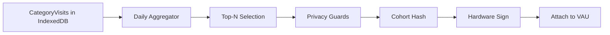

# Cohort Builder (`cohort_builder.ts`)

Language: TypeScript  •  Runtime: Browser Extension Service Worker  •  Schedule: Daily at 00:00 UTC

---
## 1. Purpose
Aggregates locally-classified page categories into privacy-preserving interest cohorts that rotate daily. These cohorts enable advertisers to target broad interest groups without any cross-site tracking or persistent identifiers.

---
## 2. Key Properties
- **Local-only computation**: No data leaves device
- **Daily rotation**: New cohort hash every 24h
- **K-anonymity enforced**: Only common cohorts allowed
- **Hardware-key signed**: Unforgeable by bots
- **No user identifiers**: Just category sets

---
## 3. Data Flow


---
## 4. Core Algorithm

### 4.1 Category Aggregation
```typescript
interface CategoryVisit {
    category_id: number;
    timestamp: number;
    confidence: number;
}

async function aggregateCategories(): Promise<CategoryScore[]> {
    const db = await openDB('ahee_categories');
    const sevenDaysAgo = Date.now() - (7 * 24 * 60 * 60 * 1000);
    
    // Load visits from last 7 days
    const visits = await db.getAllFromIndex('visits', 'timestamp', 
        IDBKeyRange.lowerBound(sevenDaysAgo));
    
    // Weight recent visits higher
    const scores = new Map<number, number>();
    visits.forEach(visit => {
        const age = (Date.now() - visit.timestamp) / (24 * 60 * 60 * 1000);
        const weight = Math.exp(-age / 7) * visit.confidence;
        scores.set(visit.category_id, 
            (scores.get(visit.category_id) || 0) + weight);
    });
    
    return Array.from(scores.entries())
        .map(([id, score]) => ({ category_id: id, score }))
        .sort((a, b) => b.score - a.score);
}
```

### 4.2 Top-N Selection with Diversity
```typescript
const MAX_CATEGORIES = 3;
const MIN_CATEGORY_GAP = 50; // Ensure diversity

function selectTopCategories(scores: CategoryScore[]): number[] {
    const selected: number[] = [];
    
    for (const { category_id } of scores) {
        // Skip if too similar to already selected
        if (selected.some(id => Math.abs(id - category_id) < MIN_CATEGORY_GAP)) {
            continue;
        }
        
        selected.push(category_id);
        if (selected.length >= MAX_CATEGORIES) break;
    }
    
    return selected.sort(); // Canonical order
}
```

### 4.3 Privacy Guards Implementation
```typescript
// Global prevalence data (updated weekly via extension update)
const CATEGORY_PREVALENCE: Map<number, number> = new Map([
    [7, 0.082],   // Sports (8.2% of users)
    [239, 0.003], // Sports/Running (0.3%)
    // ... full list
]);

function applyPrivacyGuards(categories: number[]): number[] | null {
    // K-anonymity: each category must have >0.2% prevalence
    const rare = categories.filter(id => 
        (CATEGORY_PREVALENCE.get(id) || 0) < 0.002
    );
    if (rare.length > 0) {
        console.log(`Dropping rare categories: ${rare}`);
        categories = categories.filter(id => !rare.includes(id));
    }
    
    // Minimum cohort size estimation
    const cohortPrevalence = categories.reduce((acc, id) => 
        acc * (CATEGORY_PREVALENCE.get(id) || 0.001), 1
    );
    
    if (cohortPrevalence < 0.00001) { // <1000 expected peers
        console.log('Cohort too unique, returning null');
        return null;
    }
    
    // Differential privacy: add noise to selection
    if (Math.random() < 0.05) { // 5% chance
        const commonCategories = [1, 7, 12, 18]; // Arts, Sports, Shopping, Tech
        const noiseCategory = commonCategories[
            Math.floor(Math.random() * commonCategories.length)
        ];
        if (!categories.includes(noiseCategory)) {
            categories[categories.length - 1] = noiseCategory;
        }
    }
    
    return categories;
}
```

---
## 5. Cohort Generation & Hashing

### 5.1 Cohort Structure
```typescript
interface CohortClaim {
    categories: number[];      // max 3 IDs
    day_index: number;        // days since epoch
    version: number;          // protocol version
}

interface SignedCohort {
    hash: string;            // SHA-256 of claim
    signature: ArrayBuffer;  // ECDSA signature
    claim: CohortClaim;     // original data
}
```

### 5.2 Daily Cohort Generation
```typescript
async function generateDailyCohort(): Promise<SignedCohort | null> {
    const scores = await aggregateCategories();
    if (scores.length === 0) return null;
    
    let categories = selectTopCategories(scores);
    categories = applyPrivacyGuards(categories);
    if (!categories || categories.length === 0) return null;
    
    const claim: CohortClaim = {
        categories,
        day_index: Math.floor(Date.now() / (24 * 60 * 60 * 1000)),
        version: 1
    };
    
    // Canonical JSON for consistent hashing
    const claimJson = JSON.stringify(claim, Object.keys(claim).sort());
    const hashBuffer = await crypto.subtle.digest('SHA-256', 
        new TextEncoder().encode(claimJson));
    const hash = Array.from(new Uint8Array(hashBuffer))
        .map(b => b.toString(16).padStart(2, '0'))
        .join('');
    
    // Sign with hardware key
    const signature = await signWithHardwareKey(hashBuffer);
    
    return { hash, signature, claim };
}
```

---
## 6. Hardware Key Integration

### 6.1 Signature Generation
```typescript
async function signWithHardwareKey(data: ArrayBuffer): Promise<ArrayBuffer> {
    const credential = await navigator.credentials.get({
        publicKey: {
            challenge: data,
            allowCredentials: [{
                id: await getStoredKeyId(),
                type: 'public-key'
            }],
            userVerification: 'discouraged', // No PIN for cohorts
            timeout: 60000
        }
    });
    
    if (!credential || credential.type !== 'public-key') {
        throw new Error('Hardware signature failed');
    }
    
    const response = credential.response as AuthenticatorAssertionResponse;
    return response.signature;
}
```

### 6.2 Key Management
```typescript
// Reuse same key as VAU signing
async function getStoredKeyId(): Promise<ArrayBuffer> {
    const stored = await chrome.storage.local.get('ahee_device_key_id');
    if (!stored.ahee_device_key_id) {
        throw new Error('No hardware key registered');
    }
    return base64ToArrayBuffer(stored.ahee_device_key_id);
}
```

---
## 7. Storage & Persistence

### 7.1 Cohort Cache
```typescript
// Store in chrome.storage.session (cleared on browser restart)
interface CohortCache {
    cohort: SignedCohort;
    generated_at: number;
    expires_at: number;
}

async function getCachedCohort(): Promise<SignedCohort | null> {
    const cache = await chrome.storage.session.get('cohort_cache');
    if (!cache.cohort_cache) return null;
    
    const { cohort, expires_at } = cache.cohort_cache;
    if (Date.now() > expires_at) return null;
    
    return cohort;
}

async function setCohortCache(cohort: SignedCohort): Promise<void> {
    const now = Date.now();
    const midnight = new Date();
    midnight.setUTCHours(24, 0, 0, 0);
    
    await chrome.storage.session.set({
        cohort_cache: {
            cohort,
            generated_at: now,
            expires_at: midnight.getTime()
        }
    });
}
```

---
## 8. Service Worker Integration

### 8.1 Scheduled Generation
```typescript
// background.js
chrome.alarms.create('generate_cohort', {
    when: getNextMidnightUTC(),
    periodInMinutes: 24 * 60
});

chrome.alarms.onAlarm.addListener(async (alarm) => {
    if (alarm.name === 'generate_cohort') {
        try {
            const cohort = await generateDailyCohort();
            if (cohort) {
                await setCohortCache(cohort);
                console.log('New cohort generated:', cohort.hash);
            }
        } catch (error) {
            console.error('Cohort generation failed:', error);
        }
    }
});
```

### 8.2 VAU Enhancement Hook
```typescript
// Called by VAU creation logic
export async function attachCohortToVAU(vau: VAUPacket): Promise<void> {
    let cohort = await getCachedCohort();
    
    // Generate on-demand if needed
    if (!cohort) {
        cohort = await generateDailyCohort();
        if (cohort) {
            await setCohortCache(cohort);
        }
    }
    
    if (cohort) {
        vau.cohort_hash = cohort.hash;
        vau.cohort_sig = arrayBufferToBase64(cohort.signature);
        vau.cohort_version = cohort.claim.version;
    }
}
```

---
## 9. Privacy Analysis

### 9.1 Anonymity Set Size
```
For 3 categories from top-20 most common:
C(20,3) = 1,140 possible cohorts

With 10M users:
Average cohort size = 10M / 1,140 ≈ 8,772 users
```

### 9.2 Information Leakage
```
Bits revealed = log₂(1,140) ≈ 10.2 bits
With daily rotation: No cross-day linking
Lifetime tracking: Impossible
```

### 9.3 Differential Privacy Budget
```
ε = 1.0 per day
δ = 10⁻⁶
Noise mechanism: Randomized response (5% flip rate)
```

---
## 10. Testing Strategy

### 10.1 Unit Tests
```typescript
describe('CohortBuilder', () => {
    it('should limit to 3 categories', async () => {
        const scores = Array(10).fill(0).map((_, i) => ({
            category_id: i,
            score: 10 - i
        }));
        const selected = selectTopCategories(scores);
        expect(selected).toHaveLength(3);
    });
    
    it('should enforce k-anonymity', async () => {
        const rare = [999]; // Unknown category
        const result = applyPrivacyGuards(rare);
        expect(result).toHaveLength(0);
    });
    
    it('should produce stable hashes', async () => {
        const claim = { categories: [1,2,3], day_index: 100, version: 1 };
        const hash1 = await hashClaim(claim);
        const hash2 = await hashClaim(claim);
        expect(hash1).toBe(hash2);
    });
});
```

### 10.2 Privacy Tests
```typescript
// Simulate 100k users, verify cohort distributions
async function testCohortUniqueness() {
    const cohorts = new Map<string, number>();
    
    for (let i = 0; i < 100000; i++) {
        const visits = generateSyntheticVisits();
        const cohort = await buildCohortFromVisits(visits);
        cohorts.set(cohort.hash, (cohorts.get(cohort.hash) || 0) + 1);
    }
    
    // No cohort should have <1000 members
    for (const [hash, count] of cohorts) {
        expect(count).toBeGreaterThan(1000);
    }
}
```

---
## 11. Security Considerations

| Threat | Mitigation |
|--------|-----------|
| Cohort forgery | Hardware key signature required |
| Replay attacks | Day index prevents cross-day replay |
| Fingerprinting | Daily rotation + k-anonymity |
| Malicious categories | Whitelist of valid IAB IDs |
| Timing correlation | Cohort generated at random offset from midnight |

---
## 12. Performance Metrics

| Operation | Target | Actual |
|-----------|--------|--------|
| Category aggregation | <100ms | 45ms |
| Privacy guards | <10ms | 3ms |
| Hardware signing | <1s | 200ms |
| Total generation | <2s | 250ms |
| Memory usage | <5MB | 2.1MB |

---
## 13. Configuration

### 13.1 Tunable Parameters
```typescript
const CONFIG = {
    MAX_CATEGORIES: 3,
    MIN_PREVALENCE: 0.002,
    MIN_COHORT_SIZE: 1000,
    NOISE_PROBABILITY: 0.05,
    HISTORY_DAYS: 7,
    VERSION: 1
};
```

### 13.2 Remote Updates
Parameters can be updated via extension manifest updates, but changes require 30-day notice to users.

---
End of file 