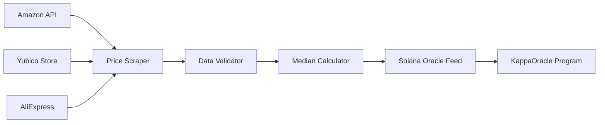

# Hardware Token Price Oracle (`hardware_token_price_oracle.py`)

Language: Python 3.11  •  Schedule: Weekly (Sundays 00:00 UTC)  •  Output: On-chain price feed

---
## 1. Purpose
Scrapes real-world prices of FIDO2/WebAuthn hardware tokens from multiple e-commerce sites to establish the cost basis for the adaptive Sybil cap κ(t). This replaces any dependency on third-party proof-of-personhood systems with pure economic barriers based on hardware costs.

---
## 2. System Design


---
## 3. Supported Token Models

### 3.1 Token Whitelist
```python
TRACKED_TOKENS = [
    {
        "model": "YubiKey 5C NFC",
        "manufacturer": "Yubico",
        "sku_patterns": ["yk5cnfc", "5060408461969"],
        "min_price": 25.0,  # Sanity check
        "max_price": 150.0
    },
    {
        "model": "SoloKeys Solo 2",
        "manufacturer": "SoloKeys",
        "sku_patterns": ["solo2", "solokey-v2"],
        "min_price": 20.0,
        "max_price": 100.0
    },
    {
        "model": "Feitian ePass FIDO2",
        "manufacturer": "Feitian",
        "sku_patterns": ["K9", "epass-fido"],
        "min_price": 15.0,
        "max_price": 80.0
    },
    {
        "model": "Google Titan Security Key",
        "manufacturer": "Google",
        "sku_patterns": ["titan-security", "GA01635"],
        "min_price": 20.0,
        "max_price": 90.0
    }
]
```

### 3.2 Exclusions
- Software-based authenticators (not hardware-bound)
- Biometric-only devices (different security model)
- Enterprise bulk pricing (not retail accessible)

---
## 4. Data Sources & Scrapers

### 4.1 Amazon Scraper
```python
import asyncio
from playwright.async_api import async_playwright
from decimal import Decimal

class AmazonScraper:
    def __init__(self):
        self.base_url = "https://www.amazon.com"
        self.headers = {
            'User-Agent': 'Mozilla/5.0 (compatible; AHEE-Oracle/1.0)'
        }
    
    async def fetch_prices(self, token_model: dict) -> List[Decimal]:
        prices = []
        
        async with async_playwright() as p:
            browser = await p.chromium.launch(headless=True)
            page = await browser.new_page()
            
            for sku in token_model['sku_patterns']:
                search_url = f"{self.base_url}/s?k={sku}"
                await page.goto(search_url)
                
                # Wait for price elements
                await page.wait_for_selector('.s-price', timeout=5000)
                
                # Extract prices
                price_elements = await page.query_selector_all('.s-price')
                for elem in price_elements[:5]:  # Top 5 results
                    price_text = await elem.inner_text()
                    price = self.parse_price(price_text)
                    
                    if self.validate_price(price, token_model):
                        prices.append(price)
            
            await browser.close()
        
        return prices
    
    def parse_price(self, price_text: str) -> Decimal:
        # Remove currency symbols and convert
        clean = price_text.replace('$', '').replace(',', '').strip()
        return Decimal(clean)
    
    def validate_price(self, price: Decimal, token_model: dict) -> bool:
        return (
            token_model['min_price'] <= price <= token_model['max_price']
        )
```

### 4.2 Yubico Direct API
```python
class YubicoScraper:
    def __init__(self):
        self.api_url = "https://www.yubico.com/wp-json/yubico/v1/products"
        
    async def fetch_prices(self, token_model: dict) -> List[Decimal]:
        if token_model['manufacturer'] != 'Yubico':
            return []
        
        async with aiohttp.ClientSession() as session:
            async with session.get(self.api_url) as response:
                products = await response.json()
                
                prices = []
                for product in products:
                    if any(sku in product['sku'] for sku in token_model['sku_patterns']):
                        # Get regional pricing
                        for region in ['US', 'EU', 'APAC']:
                            if region in product['prices']:
                                price = Decimal(str(product['prices'][region]))
                                prices.append(price)
                
                return prices
```

### 4.3 AliExpress Scraper
```python
class AliExpressScraper:
    def __init__(self):
        self.search_api = "https://www.aliexpress.com/wholesale"
        
    async def fetch_prices(self, token_model: dict) -> List[Decimal]:
        prices = []
        
        for sku in token_model['sku_patterns']:
            params = {
                'SearchText': sku,
                'SortType': 'total_tranpro_desc',
                'minPrice': str(token_model['min_price']),
                'maxPrice': str(token_model['max_price'])
            }
            
            async with aiohttp.ClientSession() as session:
                async with session.get(self.search_api, params=params) as resp:
                    # Parse HTML for prices
                    html = await resp.text()
                    prices.extend(self.extract_prices(html, token_model))
        
        return prices
```

---
## 5. Data Validation & Aggregation

### 5.1 Outlier Detection
```python
import numpy as np

class PriceValidator:
    def __init__(self):
        self.min_samples = 10
        self.z_score_threshold = 2.5
    
    def remove_outliers(self, prices: List[Decimal]) -> List[Decimal]:
        if len(prices) < self.min_samples:
            return prices
        
        # Convert to numpy for stats
        price_array = np.array([float(p) for p in prices])
        
        # Calculate z-scores
        mean = np.mean(price_array)
        std = np.std(price_array)
        z_scores = np.abs((price_array - mean) / std)
        
        # Filter outliers
        valid_indices = z_scores < self.z_score_threshold
        valid_prices = price_array[valid_indices]
        
        return [Decimal(str(p)) for p in valid_prices]
    
    def validate_sample_size(self, prices: List[Decimal], source: str) -> bool:
        if len(prices) < 5:
            logger.warning(f"Insufficient samples from {source}: {len(prices)}")
            return False
        return True
```

### 5.2 Weighted Median Calculation
```python
class PriceAggregator:
    def __init__(self):
        # Source weights based on reliability
        self.source_weights = {
            'amazon': 0.4,
            'yubico': 0.35,
            'aliexpress': 0.25
        }
    
    def calculate_weighted_median(
        self, 
        prices_by_source: Dict[str, List[Decimal]]
    ) -> Decimal:
        all_prices = []
        weights = []
        
        for source, prices in prices_by_source.items():
            cleaned = PriceValidator().remove_outliers(prices)
            source_weight = self.source_weights.get(source, 0.2)
            
            for price in cleaned:
                all_prices.append(price)
                weights.append(source_weight / len(cleaned))
        
        # Weighted median
        sorted_pairs = sorted(zip(all_prices, weights))
        cumsum = 0
        total_weight = sum(weights)
        
        for price, weight in sorted_pairs:
            cumsum += weight
            if cumsum >= total_weight / 2:
                return price
        
        return sorted_pairs[-1][0]  # Fallback
```

---
## 6. Oracle Feed Publishing

### 6.1 Data Structure
```python
@dataclass
class TokenPriceFeed:
    token_model: str
    median_price: Decimal
    sample_count: int
    sources: List[str]
    timestamp: int
    confidence: float  # 0-1 based on sample variance
```

### 6.2 Solana Publisher
```python
from solana.rpc.async_api import AsyncClient
from solana.transaction import Transaction
from anchorpy import Program, Provider, Wallet

class SolanaPricePublisher:
    def __init__(self, rpc_url: str, keypair_path: str):
        self.client = AsyncClient(rpc_url)
        self.wallet = Wallet.from_keypair_file(keypair_path)
        self.provider = Provider(self.client, self.wallet)
        
    async def publish_price_feed(self, feed: TokenPriceFeed):
        # Load KappaOracle program
        program = await Program.at(
            KAPPA_ORACLE_PROGRAM_ID,
            self.provider
        )
        
        # Build transaction
        tx = await program.rpc.update_token_price(
            token_model=feed.token_model,
            price=int(feed.median_price * 100),  # Convert to cents
            confidence=int(feed.confidence * 100),
            sample_count=feed.sample_count,
        )
        
        logger.info(f"Published price: {feed.token_model} = ${feed.median_price}")
        return tx
    
    async def publish_aggregate_feed(self, all_feeds: List[TokenPriceFeed]):
        # Calculate overall median for C_token
        all_prices = [f.median_price for f in all_feeds]
        c_token = statistics.median(all_prices)
        
        # Publish aggregate
        tx = await program.rpc.update_c_token(
            price=int(c_token * 100),
            timestamp=int(time.time())
        )
        
        logger.info(f"Published C_token = ${c_token}")
```

---
## 7. Scheduling & Reliability

### 7.1 Cron Configuration
```yaml
# kubernetes/cronjob.yaml
apiVersion: batch/v1
kind: CronJob
metadata:
  name: hardware-token-price-oracle
spec:
  schedule: "0 0 * * 0"  # Weekly on Sunday
  jobTemplate:
    spec:
      template:
        spec:
          containers:
          - name: oracle
            image: ahee/token-price-oracle:latest
            env:
            - name: RPC_URL
              value: "https://api.mainnet-beta.solana.com"
            - name: KEYPAIR_PATH
              value: "/secrets/oracle-keypair.json"
          restartPolicy: OnFailure
  successfulJobsHistoryLimit: 3
  failedJobsHistoryLimit: 1
```

### 7.2 Retry Logic
```python
class ResilientOracle:
    def __init__(self):
        self.max_retries = 3
        self.retry_delay = 300  # 5 minutes
        
    async def run_with_retries(self):
        for attempt in range(self.max_retries):
            try:
                # Run all scrapers
                prices = await self.collect_all_prices()
                
                # Validate data quality
                if not self.validate_data_quality(prices):
                    raise ValueError("Insufficient data quality")
                
                # Publish to chain
                await self.publish_feeds(prices)
                
                logger.info("Oracle update successful")
                return
                
            except Exception as e:
                logger.error(f"Attempt {attempt + 1} failed: {e}")
                if attempt < self.max_retries - 1:
                    await asyncio.sleep(self.retry_delay)
                else:
                    # Alert on final failure
                    await self.send_alert("Oracle update failed", str(e))
                    raise
```

---
## 8. Data Quality Metrics

### 8.1 Monitoring Dashboard
```python
class OracleMetrics:
    def __init__(self):
        self.prometheus_gateway = "http://prometheus:9091"
        
    def record_scrape_metrics(self, source: str, token: str, prices: List):
        metrics = {
            'oracle_scrape_count': len(prices),
            'oracle_scrape_median': float(statistics.median(prices)),
            'oracle_scrape_variance': float(statistics.variance(prices)),
            'oracle_scrape_success': 1 if prices else 0
        }
        
        for metric, value in metrics.items():
            self.push_metric(
                metric, 
                value,
                labels={'source': source, 'token': token}
            )
```

### 8.2 Alerts
```yaml
# Alert if price variance too high
- alert: TokenPriceVarianceHigh
  expr: oracle_scrape_variance > 100
  for: 1h
  annotations:
    summary: "High price variance for {{ $labels.token }}"

# Alert if scraping fails
- alert: OracleScrapeFailed
  expr: oracle_scrape_success == 0
  for: 30m
  annotations:
    summary: "Failed to scrape {{ $labels.source }}"
```

---
## 9. Historical Data Storage

### 9.1 Database Schema
```sql
CREATE TABLE token_price_history (
    id SERIAL PRIMARY KEY,
    token_model VARCHAR(100),
    median_price DECIMAL(10,2),
    min_price DECIMAL(10,2),
    max_price DECIMAL(10,2),
    sample_count INTEGER,
    sources JSONB,
    confidence DECIMAL(3,2),
    created_at TIMESTAMP DEFAULT NOW()
);

CREATE INDEX idx_token_model_date ON token_price_history(token_model, created_at);
```

### 9.2 Trend Analysis
```python
def analyze_price_trends(token_model: str, days: int = 90) -> dict:
    # Query historical data
    query = """
        SELECT median_price, created_at
        FROM token_price_history
        WHERE token_model = %s 
        AND created_at > NOW() - INTERVAL '%s days'
        ORDER BY created_at
    """
    
    # Calculate trends
    prices = execute_query(query, [token_model, days])
    
    return {
        'current': prices[-1]['median_price'],
        'avg_90d': statistics.mean([p['median_price'] for p in prices]),
        'trend': 'increasing' if prices[-1] > prices[0] else 'decreasing',
        'volatility': statistics.stdev([p['median_price'] for p in prices])
    }
```

---
## 10. Testing Strategy

### 10.1 Mock Scraper Tests
```python
@pytest.mark.asyncio
async def test_amazon_scraper():
    scraper = AmazonScraper()
    
    # Mock response
    with aioresponses() as mocked:
        mocked.get(
            re.compile(r'.*amazon.*'),
            body=load_fixture('amazon_yubikey_response.html')
        )
        
        prices = await scraper.fetch_prices(TRACKED_TOKENS[0])
        
        assert len(prices) > 0
        assert all(25 <= p <= 150 for p in prices)
```

### 10.2 Integration Tests
```python
async def test_end_to_end_oracle():
    # Run full oracle pipeline
    oracle = HardwareTokenPriceOracle()
    
    # Collect prices
    all_prices = await oracle.collect_all_prices()
    assert len(all_prices) >= 4  # All token models
    
    # Calculate median
    c_token = oracle.calculate_c_token(all_prices)
    assert 15 <= c_token <= 100  # Sanity range
    
    # Verify would publish
    feed = oracle.prepare_feed(c_token)
    assert feed.confidence > 0.7
```

---
## 11. Security Considerations

| Risk | Mitigation |
|------|-----------|
| Price manipulation | Multiple sources + outlier detection |
| Scraping blocked | Rotating proxies + user agents |
| Stale data | Timestamp validation + alerts |
| Oracle key compromise | Hardware wallet + key rotation |
| DDoS on scrapers | Rate limiting + circuit breakers |

---
## 12. Cost Analysis

### 12.1 Infrastructure
- Scraping VPS: ~$20/month
- Proxy service: ~$50/month
- Database: ~$10/month
- Total: ~$80/month

### 12.2 Solana Costs
- Weekly oracle update: ~5000 CU
- Cost: ~0.00025 SOL/week
- Annual: ~0.013 SOL (~$2)

---
## 13. Emergency Procedures

### 13.1 Manual Override
```bash
# CLI tool for emergency updates
python oracle_cli.py manual-update \
    --token "YubiKey 5C NFC" \
    --price 45.00 \
    --confidence 0.95 \
    --reason "Amazon API outage"
```

### 13.2 Fallback Values
If scraping fails completely, use 30-day moving average from historical data with reduced confidence score.

---
End of file 