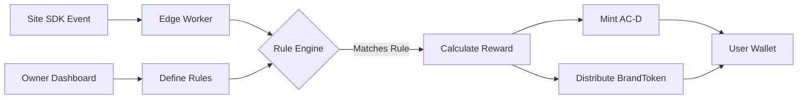

# Brand Reward Router Program (`brand_reward_router`)

Program ID: `BROUT111111111111111111111111111111111111111`  •  Language: Rust (Anchor)  •  Type: Optional

---
## 1. Purpose
Routes custom rewards (AC-D and/or BrandTokens) to users based on product-specific actions and rules defined by site owners. Enables sophisticated reward logic beyond simple time-based attention, such as purchases, sign-ups, content completion, or any custom event.

---
## 2. System Architecture


---
## 3. Account Structure

### 3.1 Router Configuration
```rust
#[account]
pub struct RouterConfig {
    pub authority: Pubkey,                   // Protocol multisig
    pub fee_basis_points: u16,               // Protocol fee (200 = 2%)
    pub max_rules_per_site: u16,             // Default: 50
    pub max_reward_per_action: u64,          // AC-D cap per event
    pub min_interval_seconds: u32,           // Anti-spam (60s)
    pub paused: bool,                        // Emergency pause
}

// PDA: ["router_config"]
```

### 3.2 Site Reward Configuration
```rust
#[account]
pub struct SiteRewardConfig {
    pub site_hash: [u8; 32],                 // SHA-256(origin)
    pub owner: Pubkey,                       // Who can update rules
    pub brand_token: Option<Pubkey>,         // Optional BrandToken
    pub rules: Vec<RewardRule>,              // Active rules
    pub daily_budget_ac: u64,                // Max AC-D per day
    pub daily_budget_brand: u64,             // Max BrandToken per day
    pub today_spent_ac: u64,                 // Track spending
    pub today_spent_brand: u64,              
    pub last_reset: i64,                     // Daily reset timestamp
    pub enabled: bool,                       // Master switch
    pub stats: SiteRewardStats,
}

#[derive(AnchorSerialize, AnchorDeserialize, Clone)]
pub struct RewardRule {
    pub id: u64,                             // Unique rule ID
    pub name: String,                        // "First Purchase"
    pub feature_id: String,                  // "purchase" 
    pub conditions: Vec<Condition>,          // Rule logic
    pub reward_ac: u64,                      // AC-D amount
    pub reward_brand: u64,                   // BrandToken amount
    pub cooldown_seconds: u32,               // Per-user cooldown
    pub max_per_user: Option<u32>,           // Lifetime limit
    pub expires_at: Option<i64>,             // Time-bound rules
    pub enabled: bool,                       // Individual toggle
}

#[derive(AnchorSerialize, AnchorDeserialize, Clone)]
pub enum Condition {
    MinValue { amount: u64 },                // e.g., purchase > $50
    MaxValue { amount: u64 },                // e.g., time < 30s  
    StringEquals { field: String, value: String },
    NumberRange { field: String, min: u64, max: u64 },
    UserSegment { segment_id: u32 },        // Cohort targeting
    TimeWindow { start_hour: u8, end_hour: u8 },
    DayOfWeek { days: u8 },                 // Bitmap
    Custom { validator: Pubkey },            // External validation
}

#[derive(AnchorSerialize, AnchorDeserialize, Default)]
pub struct SiteRewardStats {
    pub total_rewards_issued: u128,
    pub unique_users_rewarded: u64,
    pub rules_triggered: u64,
    pub last_reward_time: i64,
}

// PDA: ["site_config", site_hash]
```

### 3.3 User Action Record
```rust
#[account]
pub struct UserActionRecord {
    pub user: Pubkey,
    pub site_hash: [u8; 32],
    pub rule_id: u64,
    pub last_triggered: i64,
    pub times_triggered: u32,
    pub total_earned_ac: u64,
    pub total_earned_brand: u64,
}

// PDA: ["user_action", user, site_hash, rule_id.to_le_bytes()]
```

### 3.4 Feature Event
```rust
#[derive(AnchorSerialize, AnchorDeserialize)]
pub struct FeatureEvent {
    pub vau_hash: [u8; 32],                  // Links to VAU
    pub feature_id: String,                  // "purchase", "signup", etc
    pub timestamp: i64,
    pub properties: BTreeMap<String, PropertyValue>,
}

#[derive(AnchorSerialize, AnchorDeserialize)]
pub enum PropertyValue {
    String(String),
    Number(u64),
    Boolean(bool),
    Array(Vec<PropertyValue>),
}

// Submitted by edge worker, not stored on-chain
```

---
## 4. Core Instructions

### 4.1 Initialize Site Configuration
```rust
pub fn initialize_site_config(
    ctx: Context<InitializeSiteConfig>,
    site_hash: [u8; 32],
    brand_token: Option<Pubkey>,
) -> Result<()> {
    let config = &mut ctx.accounts.site_config;
    let clock = Clock::get()?;
    
    // Verify caller owns the site
    require!(
        is_site_owner(&ctx.accounts.owner, &site_hash)?,
        ErrorCode::NotSiteOwner
    );
    
    config.site_hash = site_hash;
    config.owner = ctx.accounts.owner.key();
    config.brand_token = brand_token;
    config.rules = Vec::with_capacity(50);
    config.daily_budget_ac = 10_000_000_000_000; // 10k AC-D default
    config.daily_budget_brand = 100_000_000_000; // 100k brand default
    config.today_spent_ac = 0;
    config.today_spent_brand = 0;
    config.last_reset = clock.unix_timestamp;
    config.enabled = true;
    config.stats = SiteRewardStats::default();
    
    // If brand token specified, verify it exists
    if let Some(mint) = brand_token {
        verify_brand_token_exists(mint)?;
    }
    
    emit!(SiteConfigInitialized {
        site_hash,
        owner: ctx.accounts.owner.key(),
        brand_token,
    });
    
    Ok(())
}
```

### 4.2 Add Reward Rule
```rust
pub fn add_reward_rule(
    ctx: Context<AddRewardRule>,
    rule: RewardRule,
) -> Result<()> {
    let config = &mut ctx.accounts.site_config;
    let router_config = &ctx.accounts.router_config;
    
    // Only owner can add rules
    require!(
        ctx.accounts.owner.key() == config.owner,
        ErrorCode::UnauthorizedOwner
    );
    
    // Validate rule
    require!(
        config.rules.len() < router_config.max_rules_per_site as usize,
        ErrorCode::TooManyRules
    );
    
    require!(
        rule.reward_ac <= router_config.max_reward_per_action,
        ErrorCode::RewardTooHigh
    );
    
    require!(
        rule.feature_id.len() <= 32 && rule.feature_id.len() > 0,
        ErrorCode::InvalidFeatureId
    );
    
    require!(
        rule.cooldown_seconds >= router_config.min_interval_seconds,
        ErrorCode::CooldownTooShort
    );
    
    // Validate conditions
    for condition in &rule.conditions {
        validate_condition(condition)?;
    }
    
    // Assign unique ID
    let rule_id = config.rules.len() as u64;
    let mut new_rule = rule;
    new_rule.id = rule_id;
    
    config.rules.push(new_rule.clone());
    
    emit!(RewardRuleAdded {
        site_hash: config.site_hash,
        rule_id,
        name: new_rule.name,
        feature_id: new_rule.feature_id,
        reward_ac: new_rule.reward_ac,
        reward_brand: new_rule.reward_brand,
    });
    
    Ok(())
}
```

### 4.3 Process Feature Event
```rust
pub fn process_feature_event(
    ctx: Context<ProcessFeatureEvent>,
    event: FeatureEvent,
) -> Result<()> {
    let config = &mut ctx.accounts.site_config;
    let clock = Clock::get()?;
    
    // Reset daily budgets if needed
    let current_day = clock.unix_timestamp / 86400;
    let last_day = config.last_reset / 86400;
    
    if current_day > last_day {
        config.today_spent_ac = 0;
        config.today_spent_brand = 0;
        config.last_reset = clock.unix_timestamp;
    }
    
    // Verify event authenticity (from edge worker)
    require!(
        verify_event_signature(&event, &ctx.accounts.edge_signer)?,
        ErrorCode::InvalidEventSignature
    );
    
    // Check site enabled
    require!(config.enabled, ErrorCode::SiteDisabled);
    
    // Find matching rules
    let matching_rules: Vec<&RewardRule> = config.rules.iter()
        .filter(|rule| {
            rule.enabled &&
            rule.feature_id == event.feature_id &&
            rule.expires_at.map_or(true, |exp| clock.unix_timestamp < exp) &&
            evaluate_conditions(&rule.conditions, &event.properties)
        })
        .collect();
    
    if matching_rules.is_empty() {
        msg!("No matching rules for event");
        return Ok(());
    }
    
    // Process each matching rule
    let user = ctx.accounts.user.key();
    let mut total_ac_reward = 0u64;
    let mut total_brand_reward = 0u64;
    
    for rule in matching_rules {
        // Check user cooldown
        let action_record = get_or_create_action_record(
            &mut ctx.accounts.user_action_record,
            &user,
            &config.site_hash,
            rule.id,
        )?;
        
        if clock.unix_timestamp - action_record.last_triggered < rule.cooldown_seconds as i64 {
            msg!("Rule {} still in cooldown", rule.id);
            continue;
        }
        
        // Check max per user limit
        if let Some(max) = rule.max_per_user {
            if action_record.times_triggered >= max {
                msg!("User hit max for rule {}", rule.id);
                continue;
            }
        }
        
        // Check daily budget
        let ac_available = config.daily_budget_ac.saturating_sub(config.today_spent_ac);
        let brand_available = config.daily_budget_brand.saturating_sub(config.today_spent_brand);
        
        let ac_to_mint = rule.reward_ac.min(ac_available);
        let brand_to_distribute = rule.reward_brand.min(brand_available);
        
        if ac_to_mint == 0 && brand_to_distribute == 0 {
            msg!("Daily budget exhausted");
            continue;
        }
        
        // Update action record
        action_record.last_triggered = clock.unix_timestamp;
        action_record.times_triggered += 1;
        action_record.total_earned_ac += ac_to_mint;
        action_record.total_earned_brand += brand_to_distribute;
        
        total_ac_reward += ac_to_mint;
        total_brand_reward += brand_to_distribute;
    }
    
    // Mint AC-D rewards
    if total_ac_reward > 0 {
        mint_ac_reward(
            ctx.accounts,
            &user,
            total_ac_reward,
        )?;
        
        config.today_spent_ac += total_ac_reward;
    }
    
    // Distribute BrandToken rewards
    if total_brand_reward > 0 && config.brand_token.is_some() {
        distribute_brand_reward(
            ctx.accounts,
            &user,
            config.brand_token.unwrap(),
            total_brand_reward,
        )?;
        
        config.today_spent_brand += total_brand_reward;
    }
    
    // Update stats
    config.stats.total_rewards_issued += (total_ac_reward + total_brand_reward) as u128;
    config.stats.unique_users_rewarded += 1; // Approximate
    config.stats.rules_triggered += matching_rules.len() as u64;
    config.stats.last_reward_time = clock.unix_timestamp;
    
    emit!(FeatureRewardProcessed {
        user,
        site_hash: config.site_hash,
        feature_id: event.feature_id,
        rules_matched: matching_rules.len(),
        ac_rewarded: total_ac_reward,
        brand_rewarded: total_brand_reward,
        event_properties: format!("{:?}", event.properties),
    });
    
    Ok(())
}
```

### 4.4 Update Rule
```rust
pub fn update_rule(
    ctx: Context<UpdateRule>,
    rule_id: u64,
    updates: RuleUpdate,
) -> Result<()> {
    let config = &mut ctx.accounts.site_config;
    
    require!(
        ctx.accounts.owner.key() == config.owner,
        ErrorCode::UnauthorizedOwner
    );
    
    let rule = config.rules.iter_mut()
        .find(|r| r.id == rule_id)
        .ok_or(ErrorCode::RuleNotFound)?;
    
    // Apply updates
    if let Some(reward_ac) = updates.reward_ac {
        rule.reward_ac = reward_ac;
    }
    
    if let Some(reward_brand) = updates.reward_brand {
        rule.reward_brand = reward_brand;
    }
    
    if let Some(cooldown) = updates.cooldown_seconds {
        rule.cooldown_seconds = cooldown;
    }
    
    if let Some(enabled) = updates.enabled {
        rule.enabled = enabled;
    }
    
    if let Some(conditions) = updates.conditions {
        for condition in &conditions {
            validate_condition(condition)?;
        }
        rule.conditions = conditions;
    }
    
    emit!(RuleUpdated {
        site_hash: config.site_hash,
        rule_id,
        updates: format!("{:?}", updates),
    });
    
    Ok(())
}
```

---
## 5. Helper Functions

### 5.1 Condition Evaluator
```rust
fn evaluate_conditions(
    conditions: &[Condition],
    properties: &BTreeMap<String, PropertyValue>,
) -> bool {
    // All conditions must match (AND logic)
    conditions.iter().all(|condition| {
        match condition {
            Condition::MinValue { amount } => {
                properties.get("value")
                    .and_then(|v| match v {
                        PropertyValue::Number(n) => Some(n >= amount),
                        _ => None,
                    })
                    .unwrap_or(false)
            },
            
            Condition::StringEquals { field, value } => {
                properties.get(field)
                    .and_then(|v| match v {
                        PropertyValue::String(s) => Some(s == value),
                        _ => None,
                    })
                    .unwrap_or(false)
            },
            
            Condition::TimeWindow { start_hour, end_hour } => {
                let hour = (Clock::get().unwrap().unix_timestamp / 3600 % 24) as u8;
                if start_hour <= end_hour {
                    hour >= *start_hour && hour <= *end_hour
                } else {
                    // Wraps midnight
                    hour >= *start_hour || hour <= *end_hour
                }
            },
            
            Condition::DayOfWeek { days } => {
                let day = (Clock::get().unwrap().unix_timestamp / 86400 % 7) as u8;
                days & (1 << day) != 0
            },
            
            Condition::Custom { validator } => {
                // CPI to custom validator program
                validate_custom_condition(validator, properties).unwrap_or(false)
            },
            
            _ => true, // Other conditions...
        }
    })
}
```

### 5.2 AC-D Minting
```rust
fn mint_ac_reward<'info>(
    accounts: &MintRewardAccounts<'info>,
    user: &Pubkey,
    amount: u64,
) -> Result<()> {
    // CPI to attention_token program
    let cpi_accounts = MintTo {
        mint: accounts.ac_mint.to_account_info(),
        to: accounts.user_ac_account.to_account_info(),
        authority: accounts.mint_authority.to_account_info(),
    };
    
    let seeds = &[
        b"reward_minter",
        &[accounts.bumps.mint_authority],
    ];
    
    let cpi_ctx = CpiContext::new_with_signer(
        accounts.attention_token_program.to_account_info(),
        cpi_accounts,
        &[seeds],
    );
    
    attention_token::cpi::authorized_mint(cpi_ctx, *user, amount, MintType::Feature)?;
    
    Ok(())
}
```

### 5.3 BrandToken Distribution
```rust
fn distribute_brand_reward<'info>(
    accounts: &DistributeBrandAccounts<'info>,
    user: &Pubkey,
    brand_mint: Pubkey,
    amount: u64,
) -> Result<()> {
    // CPI to brand_token_factory
    let cpi_accounts = WithdrawFromEscrow {
        escrow: accounts.brand_escrow.to_account_info(),
        escrow_token_account: accounts.escrow_token_account.to_account_info(),
        recipient_token_account: accounts.user_brand_account.to_account_info(),
        authority: accounts.router_authority.to_account_info(),
        token_program: accounts.token_program.to_account_info(),
    };
    
    let seeds = &[
        b"router_authority",
        &[accounts.bumps.router_authority],
    ];
    
    let cpi_ctx = CpiContext::new_with_signer(
        accounts.brand_token_factory_program.to_account_info(),
        cpi_accounts,
        &[seeds],
    );
    
    brand_token_factory::cpi::withdraw_from_escrow(cpi_ctx, amount, *user)?;
    
    Ok(())
}
```

---
## 6. Example Rules

### 6.1 First Purchase Bonus
```rust
RewardRule {
    name: "First Purchase Bonus".to_string(),
    feature_id: "purchase".to_string(),
    conditions: vec![
        Condition::MinValue { amount: 1000 }, // $10 minimum
    ],
    reward_ac: 500_000_000_000,             // 500 AC-D
    reward_brand: 5_000_000_000,            // 5000 brand tokens
    cooldown_seconds: 0,                    // One-time
    max_per_user: Some(1),                  // Once per user
    expires_at: None,
    enabled: true,
}
```

### 6.2 Video Completion Reward
```rust
RewardRule {
    name: "Watch Full Video".to_string(),
    feature_id: "video_complete".to_string(),
    conditions: vec![
        Condition::MinValue { amount: 90 },  // 90% watched
    ],
    reward_ac: 50_000_000_000,             // 50 AC-D
    reward_brand: 100_000_000,             // 100 brand
    cooldown_seconds: 3600,                // 1 hour
    max_per_user: Some(10),                // 10 per day
    expires_at: None,
    enabled: true,
}
```

### 6.3 Time-Limited Flash Sale
```rust
RewardRule {
    name: "Flash Sale Bonus".to_string(),
    feature_id: "purchase".to_string(),
    conditions: vec![
        Condition::TimeWindow { start_hour: 14, end_hour: 16 },
        Condition::DayOfWeek { days: 0b0111110 }, // Mon-Sat
        Condition::MinValue { amount: 5000 },     // $50+
    ],
    reward_ac: 1000_000_000_000,           // 1000 AC-D
    reward_brand: 10_000_000_000,          // 10k brand
    cooldown_seconds: 86400,               // Daily
    max_per_user: None,
    expires_at: Some(1735689600),          // Jan 1, 2025
    enabled: true,
}
```

---
## 7. Security Considerations

### 7.1 Attack Vectors
| Attack | Mitigation |
|--------|-----------|
| Event forgery | Edge worker signature verification |
| Rule spam | Max rules limit + validation |
| Budget drain | Daily caps + cooldowns |
| Condition bypass | Server-side validation |
| Double spending | Idempotency via VAU hash |

### 7.2 Trust Model
- Edge workers are trusted to report accurate events
- Site owners are trusted to create fair rules
- Protocol enforces budgets and rate limits
- Users cannot forge events or bypass conditions

---
## 8. Testing

### 8.1 Unit Tests
```rust
#[cfg(test)]
mod tests {
    #[tokio::test]
    async fn test_rule_matching() {
        let rule = create_purchase_rule(
            min_value: 5000,  // $50
            reward_ac: 100_000_000_000,
        );
        
        // Should match
        let event1 = create_event("purchase", &[
            ("value", PropertyValue::Number(7500)), // $75
        ]);
        assert!(evaluate_rule(&rule, &event1));
        
        // Should not match
        let event2 = create_event("purchase", &[
            ("value", PropertyValue::Number(2500)), // $25
        ]);
        assert!(!evaluate_rule(&rule, &event2));
    }
    
    #[tokio::test]
    async fn test_daily_budget_enforcement() {
        let mut test = setup_test().await;
        
        // Set daily budget to 1000 AC-D
        set_daily_budget(&mut test, 1000_000_000_000).await?;
        
        // Process events that would exceed budget
        for i in 0..20 {
            let event = create_event("action", &[]);
            process_event(&mut test, event, 100_000_000_000).await?;
        }
        
        // Check only 1000 AC-D was minted
        let stats = get_site_stats(&test).await;
        assert_eq!(stats.today_spent_ac, 1000_000_000_000);
    }
}
```

### 8.2 Integration Tests
```rust
#[tokio::test]
async fn test_purchase_flow() {
    let mut test = setup_full_test().await;
    
    // Owner creates rule: $50+ purchase = 500 AC + 5000 SHOP
    let rule = create_purchase_bonus_rule(5000, 500, 5000);
    add_rule(&mut test, site_owner, rule).await?;
    
    // User makes qualifying purchase
    let event = FeatureEvent {
        vau_hash: [0; 32],
        feature_id: "purchase".to_string(),
        timestamp: Clock::get()?.unix_timestamp,
        properties: btreemap! {
            "value".to_string() => PropertyValue::Number(7500),
            "item_id".to_string() => PropertyValue::String("SKU123".to_string()),
        },
    };
    
    process_feature_event(&mut test, user, event).await?;
    
    // Verify rewards
    let ac_balance = get_ac_balance(&test, user).await;
    let shop_balance = get_brand_balance(&test, user, shop_token).await;
    
    assert_eq!(ac_balance, 500_000_000_000);
    assert_eq!(shop_balance, 5000_000_000);
    
    // Verify stats updated
    let stats = get_site_stats(&test, site_hash).await;
    assert_eq!(stats.rules_triggered, 1);
    assert_eq!(stats.unique_users_rewarded, 1);
}
```

---
## 9. Monitoring

### 9.1 Metrics
```sql
-- Rule effectiveness
SELECT 
    r.site_hash,
    r.rule_id,
    r.name,
    COUNT(DISTINCT u.user) as unique_users,
    SUM(u.times_triggered) as total_triggers,
    SUM(u.total_earned_ac) as ac_distributed,
    SUM(u.total_earned_brand) as brand_distributed,
    AVG(u.total_earned_ac / NULLIF(u.times_triggered, 0)) as avg_ac_per_trigger
FROM reward_rules r
JOIN user_action_records u ON r.rule_id = u.rule_id
WHERE u.last_triggered > NOW() - INTERVAL '7 days'
GROUP BY r.site_hash, r.rule_id, r.name
ORDER BY ac_distributed DESC;

-- Budget utilization
SELECT
    site_hash,
    DATE(last_reset) as date,
    daily_budget_ac,
    today_spent_ac,
    today_spent_ac::float / NULLIF(daily_budget_ac, 0) as ac_utilization,
    daily_budget_brand,
    today_spent_brand,
    today_spent_brand::float / NULLIF(daily_budget_brand, 0) as brand_utilization
FROM site_reward_configs
WHERE enabled = true
ORDER BY date DESC, ac_utilization DESC;
```

### 9.2 Alerts
```yaml
- alert: RuleNotTriggering
  expr: |
    time() - reward_rule_last_triggered > 86400
    AND reward_rule_enabled == 1
  annotations:
    summary: "Rule {{ $labels.rule_name }} not triggered for 24h"

- alert: BudgetExhaustedEarly
  expr: |
    site_budget_utilization > 0.9
    AND hour() < 18
  annotations:
    summary: "Site {{ $labels.site }} used 90% of budget before 6pm"

- alert: UnusualRewardSpike
  expr: |
    rate(rewards_distributed[5m]) > 10 * rate(rewards_distributed[1h] offset 1d)
  annotations:
    summary: "10x increase in reward rate"
```

---
## 10. Dashboard Integration

### 10.1 Rule Builder UI
```typescript
interface RuleBuilderProps {
    siteHash: string;
    brandToken?: string;
}

export function RuleBuilder({ siteHash, brandToken }: RuleBuilderProps) {
    const [conditions, setConditions] = useState<Condition[]>([]);
    
    const templates = [
        {
            name: "First Purchase",
            template: {
                feature_id: "purchase",
                conditions: [{ type: "MinValue", amount: 1000 }],
                reward_ac: 500,
                reward_brand: 5000,
                max_per_user: 1,
            }
        },
        // More templates...
    ];
    
    return (
        <div className="rule-builder">
            <h3>Create Reward Rule</h3>
            
            <Select 
                label="Template"
                options={templates}
                onChange={loadTemplate}
            />
            
            <Input
                label="Feature ID"
                placeholder="purchase, signup, video_complete..."
            />
            
            <ConditionBuilder
                conditions={conditions}
                onChange={setConditions}
            />
            
            <RewardConfig
                hasAC={true}
                hasBrand={!!brandToken}
            />
            
            <Button onClick={createRule}>
                Create Rule
            </Button>
        </div>
    );
}
```

---
## 11. Best Practices

### 11.1 For Site Owners
1. Start with simple rules, iterate based on data
2. Use meaningful feature IDs that match your analytics
3. Set reasonable cooldowns to prevent gaming
4. Monitor budget utilization and adjust daily caps
5. Create time-limited rules for promotions

### 11.2 For Users  
1. Complete high-value actions for best rewards
2. Check rule cooldowns before repeating actions
3. Time actions for bonus windows
4. Collect both AC-D and BrandTokens

---
End of file 