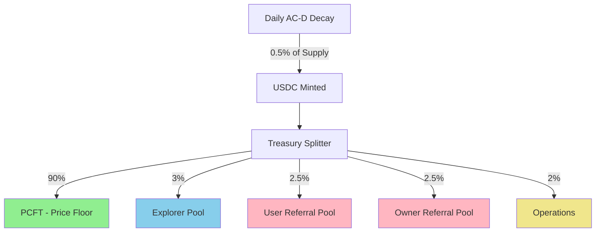

# Treasury Splitter Program (`treasury_splitter`)

Program ID: `TREAS111111111111111111111111111111111111111`  •  Language: Rust (Anchor)  •  Audit: Required

---
## 1. Purpose
Automatically splits daily USDC revenue from AC-D token decay into designated protocol pots according to fixed ratios. Ensures transparent, immutable distribution of protocol revenue to support floor price, reward pools, and operational needs.

---
## 2. Revenue Flow


---
## 3. Account Structure

### 3.1 Program Configuration
```rust
#[account]
pub struct TreasuryConfig {
    pub authority: Pubkey,                    // Multisig authority
    pub update_delay: i64,                    // Timelock for changes (72h)
    
    // Distribution ratios (basis points, total = 10000)
    pub pcft_ratio: u16,                     // 9000 (90%)
    pub explorer_ratio: u16,                 // 300 (3%)
    pub user_referral_ratio: u16,            // 250 (2.5%)
    pub owner_referral_ratio: u16,           // 250 (2.5%)
    pub operations_ratio: u16,               // 200 (2%)
    
    // Recipient PDAs
    pub pcft_vault: Pubkey,
    pub explorer_pot: Pubkey,
    pub user_referral_pot: Pubkey,
    pub owner_referral_pot: Pubkey,
    pub operations_wallet: Pubkey,
    
    // Stats
    pub total_distributed: u128,
    pub last_distribution: i64,
}

// PDA: ["config"]
```

### 3.2 Daily Distribution Record
```rust
#[account]
pub struct DailyDistribution {
    pub day_index: u64,                      // Days since epoch
    pub timestamp: i64,                      // Unix timestamp
    pub total_amount: u64,                   // Total USDC distributed
    
    // Individual distributions
    pub pcft_amount: u64,
    pub explorer_amount: u64,
    pub user_referral_amount: u64,
    pub owner_referral_amount: u64,
    pub operations_amount: u64,
    
    pub tx_signature: [u8; 64],             // For audit trail
}

// PDA: ["distribution", day_index.to_le_bytes()]
```

### 3.3 Pot Accounts
```rust
#[account]
pub struct ProtocolPot {
    pub pot_type: PotType,
    pub authority: Pubkey,                   // Program that can spend
    pub balance: u64,                        // Current USDC balance
    pub total_received: u128,                // Lifetime receipts
    pub total_spent: u128,                   // Lifetime spending
    pub last_funded: i64,
    pub daily_limit: Option<u64>,            // Optional spend limit
}

#[derive(AnchorSerialize, AnchorDeserialize, PartialEq)]
pub enum PotType {
    PriceFloor,      // PCFT
    Explorer,        // Daily explorer rewards
    UserReferral,    // User referral bonuses
    OwnerReferral,   // Site owner referrals
    Operations,      // Team operations
}

// PDAs: ["pot", pot_type as u8]
```

---
## 4. Core Instructions

### 4.1 Initialize
```rust
pub fn initialize(
    ctx: Context<Initialize>,
    config: TreasuryConfigInput,
) -> Result<()> {
    let treasury_config = &mut ctx.accounts.config;
    let clock = Clock::get()?;
    
    // Validate ratios sum to 10000 (100%)
    let total_ratio = config.pcft_ratio + 
                     config.explorer_ratio + 
                     config.user_referral_ratio + 
                     config.owner_referral_ratio + 
                     config.operations_ratio;
    
    require!(
        total_ratio == 10000,
        ErrorCode::InvalidRatioSum
    );
    
    // Set configuration
    treasury_config.authority = ctx.accounts.authority.key();
    treasury_config.update_delay = 259200; // 72 hours
    treasury_config.pcft_ratio = config.pcft_ratio;
    treasury_config.explorer_ratio = config.explorer_ratio;
    treasury_config.user_referral_ratio = config.user_referral_ratio;
    treasury_config.owner_referral_ratio = config.owner_referral_ratio;
    treasury_config.operations_ratio = config.operations_ratio;
    
    // Initialize pot addresses
    treasury_config.pcft_vault = ctx.accounts.pcft_vault.key();
    treasury_config.explorer_pot = ctx.accounts.explorer_pot.key();
    treasury_config.user_referral_pot = ctx.accounts.user_referral_pot.key();
    treasury_config.owner_referral_pot = ctx.accounts.owner_referral_pot.key();
    treasury_config.operations_wallet = ctx.accounts.operations_wallet.key();
    
    treasury_config.total_distributed = 0;
    treasury_config.last_distribution = clock.unix_timestamp;
    
    // Initialize each pot
    initialize_pot(&mut ctx.accounts.pcft_pot, PotType::PriceFloor)?;
    initialize_pot(&mut ctx.accounts.explorer_pot_account, PotType::Explorer)?;
    initialize_pot(&mut ctx.accounts.user_referral_pot_account, PotType::UserReferral)?;
    initialize_pot(&mut ctx.accounts.owner_referral_pot_account, PotType::OwnerReferral)?;
    initialize_pot(&mut ctx.accounts.operations_pot, PotType::Operations)?;
    
    emit!(TreasuryInitialized {
        authority: treasury_config.authority,
        ratios: format!("PCFT: {}%, Explorer: {}%, Referrals: {}%, Ops: {}%",
            config.pcft_ratio / 100,
            config.explorer_ratio / 100,
            (config.user_referral_ratio + config.owner_referral_ratio) / 100,
            config.operations_ratio / 100
        ),
    });
    
    Ok(())
}
```

### 4.2 Split Revenue
```rust
pub fn split_revenue(
    ctx: Context<SplitRevenue>,
    amount: u64,
) -> Result<()> {
    let config = &ctx.accounts.config;
    let clock = Clock::get()?;
    
    // Only callable by attention_token program after rebase
    require!(
        ctx.accounts.caller.key() == attention_token::ID,
        ErrorCode::UnauthorizedCaller
    );
    
    // Calculate distributions
    let distributions = calculate_distributions(amount, config)?;
    
    // Transfer USDC to each pot
    // PCFT (Price Controlled Floor Treasury)
    transfer_usdc(
        &ctx.accounts.source_account,
        &ctx.accounts.pcft_vault_account,
        distributions.pcft,
        &ctx.accounts.token_program,
        &ctx.accounts.source_authority,
    )?;
    
    // Explorer Pool
    transfer_usdc(
        &ctx.accounts.source_account,
        &ctx.accounts.explorer_pot_account,
        distributions.explorer,
        &ctx.accounts.token_program,
        &ctx.accounts.source_authority,
    )?;
    
    // User Referral Pool
    transfer_usdc(
        &ctx.accounts.source_account,
        &ctx.accounts.user_referral_pot_account,
        distributions.user_referral,
        &ctx.accounts.token_program,
        &ctx.accounts.source_authority,
    )?;
    
    // Owner Referral Pool
    transfer_usdc(
        &ctx.accounts.source_account,
        &ctx.accounts.owner_referral_pot_account,
        distributions.owner_referral,
        &ctx.accounts.token_program,
        &ctx.accounts.source_authority,
    )?;
    
    // Operations
    transfer_usdc(
        &ctx.accounts.source_account,
        &ctx.accounts.operations_account,
        distributions.operations,
        &ctx.accounts.token_program,
        &ctx.accounts.source_authority,
    )?;
    
    // Update pot balances
    update_pot_balance(&mut ctx.accounts.pcft_pot, distributions.pcft)?;
    update_pot_balance(&mut ctx.accounts.explorer_pot, distributions.explorer)?;
    update_pot_balance(&mut ctx.accounts.user_referral_pot, distributions.user_referral)?;
    update_pot_balance(&mut ctx.accounts.owner_referral_pot, distributions.owner_referral)?;
    update_pot_balance(&mut ctx.accounts.operations_pot, distributions.operations)?;
    
    // Record distribution
    let day_index = (clock.unix_timestamp / 86400) as u64;
    let distribution_record = &mut ctx.accounts.daily_distribution;
    
    distribution_record.day_index = day_index;
    distribution_record.timestamp = clock.unix_timestamp;
    distribution_record.total_amount = amount;
    distribution_record.pcft_amount = distributions.pcft;
    distribution_record.explorer_amount = distributions.explorer;
    distribution_record.user_referral_amount = distributions.user_referral;
    distribution_record.owner_referral_amount = distributions.owner_referral;
    distribution_record.operations_amount = distributions.operations;
    
    // Update global stats
    let config = &mut ctx.accounts.config;
    config.total_distributed += amount as u128;
    config.last_distribution = clock.unix_timestamp;
    
    emit!(RevenueDistributed {
        day_index,
        total_amount: amount,
        distributions,
        timestamp: clock.unix_timestamp,
    });
    
    Ok(())
}
```

### 4.3 Withdraw from Pot (Authorized Programs Only)
```rust
pub fn withdraw_from_pot(
    ctx: Context<WithdrawFromPot>,
    pot_type: PotType,
    amount: u64,
    recipient: Pubkey,
) -> Result<()> {
    let pot = &mut ctx.accounts.pot;
    
    // Verify correct pot
    require!(
        pot.pot_type == pot_type,
        ErrorCode::IncorrectPot
    );
    
    // Verify authorized program
    let authorized = match pot_type {
        PotType::Explorer => ctx.accounts.caller.key() == explorer_referral::ID,
        PotType::UserReferral => ctx.accounts.caller.key() == explorer_referral::ID,
        PotType::OwnerReferral => ctx.accounts.caller.key() == explorer_referral::ID,
        PotType::Operations => ctx.accounts.caller.key() == pot.authority,
        PotType::PriceFloor => false, // PCFT never withdraws
    };
    
    require!(authorized, ErrorCode::UnauthorizedWithdrawal);
    
    // Check balance
    require!(
        pot.balance >= amount,
        ErrorCode::InsufficientPotBalance
    );
    
    // Check daily limit if set
    if let Some(daily_limit) = pot.daily_limit {
        let spent_today = get_spent_today(pot)?;
        require!(
            spent_today + amount <= daily_limit,
            ErrorCode::DailyLimitExceeded
        );
    }
    
    // Transfer USDC
    transfer_usdc_from_pot(
        &ctx.accounts.pot_token_account,
        &ctx.accounts.recipient_account,
        amount,
        &ctx.accounts.token_program,
        &pot_seeds(pot_type),
    )?;
    
    // Update balances
    pot.balance -= amount;
    pot.total_spent += amount as u128;
    
    emit!(PotWithdrawal {
        pot_type,
        amount,
        recipient,
        remaining_balance: pot.balance,
        caller: ctx.accounts.caller.key(),
    });
    
    Ok(())
}
```

### 4.4 Update Configuration (Timelocked)
```rust
pub fn propose_config_update(
    ctx: Context<ProposeUpdate>,
    new_config: TreasuryConfigInput,
) -> Result<()> {
    let proposal = &mut ctx.accounts.proposal;
    let clock = Clock::get()?;
    
    require!(
        ctx.accounts.authority.key() == ctx.accounts.config.authority,
        ErrorCode::UnauthorizedAuthority
    );
    
    // Validate new ratios
    let total = new_config.pcft_ratio + 
                new_config.explorer_ratio + 
                new_config.user_referral_ratio + 
                new_config.owner_referral_ratio + 
                new_config.operations_ratio;
    
    require!(total == 10000, ErrorCode::InvalidRatioSum);
    
    // Store proposal
    proposal.proposer = ctx.accounts.authority.key();
    proposal.new_config = new_config;
    proposal.proposed_at = clock.unix_timestamp;
    proposal.executable_at = clock.unix_timestamp + ctx.accounts.config.update_delay;
    proposal.executed = false;
    
    emit!(ConfigUpdateProposed {
        proposer: proposal.proposer,
        executable_at: proposal.executable_at,
        changes: describe_changes(&ctx.accounts.config, &new_config),
    });
    
    Ok(())
}

pub fn execute_config_update(
    ctx: Context<ExecuteUpdate>,
) -> Result<()> {
    let proposal = &ctx.accounts.proposal;
    let clock = Clock::get()?;
    
    require!(
        clock.unix_timestamp >= proposal.executable_at,
        ErrorCode::TimelockNotExpired
    );
    
    require!(!proposal.executed, ErrorCode::ProposalAlreadyExecuted);
    
    // Apply new configuration
    let config = &mut ctx.accounts.config;
    config.pcft_ratio = proposal.new_config.pcft_ratio;
    config.explorer_ratio = proposal.new_config.explorer_ratio;
    config.user_referral_ratio = proposal.new_config.user_referral_ratio;
    config.owner_referral_ratio = proposal.new_config.owner_referral_ratio;
    config.operations_ratio = proposal.new_config.operations_ratio;
    
    // Mark executed
    let proposal = &mut ctx.accounts.proposal;
    proposal.executed = true;
    
    emit!(ConfigUpdated {
        old_ratios: get_ratio_string(&ctx.accounts.config),
        new_ratios: get_ratio_string(&proposal.new_config),
        executor: ctx.accounts.executor.key(),
    });
    
    Ok(())
}
```

---
## 5. Helper Functions

### 5.1 Distribution Calculator
```rust
#[derive(Debug, AnchorSerialize, AnchorDeserialize)]
pub struct Distributions {
    pub pcft: u64,
    pub explorer: u64,
    pub user_referral: u64,
    pub owner_referral: u64,
    pub operations: u64,
}

fn calculate_distributions(
    total_amount: u64,
    config: &TreasuryConfig,
) -> Result<Distributions> {
    // Use u128 to prevent overflow
    let total_u128 = total_amount as u128;
    
    let pcft = (total_u128 * config.pcft_ratio as u128 / 10000) as u64;
    let explorer = (total_u128 * config.explorer_ratio as u128 / 10000) as u64;
    let user_referral = (total_u128 * config.user_referral_ratio as u128 / 10000) as u64;
    let owner_referral = (total_u128 * config.owner_referral_ratio as u128 / 10000) as u64;
    
    // Operations gets remainder to handle rounding
    let operations = total_amount - pcft - explorer - user_referral - owner_referral;
    
    Ok(Distributions {
        pcft,
        explorer,
        user_referral,
        owner_referral,
        operations,
    })
}
```

### 5.2 USDC Transfer Helper
```rust
fn transfer_usdc<'info>(
    from: &Account<'info, TokenAccount>,
    to: &Account<'info, TokenAccount>,
    amount: u64,
    token_program: &Program<'info, Token>,
    authority: &AccountInfo<'info>,
) -> Result<()> {
    let cpi_accounts = Transfer {
        from: from.to_account_info(),
        to: to.to_account_info(),
        authority: authority.clone(),
    };
    
    let cpi_ctx = CpiContext::new(token_program.to_account_info(), cpi_accounts);
    
    token::transfer(cpi_ctx, amount)?;
    
    Ok(())
}
```

### 5.3 Pot Balance Updates
```rust
fn update_pot_balance(
    pot: &mut Account<ProtocolPot>,
    amount: u64,
) -> Result<()> {
    pot.balance = pot.balance
        .checked_add(amount)
        .ok_or(ErrorCode::BalanceOverflow)?;
    
    pot.total_received = pot.total_received
        .checked_add(amount as u128)
        .ok_or(ErrorCode::BalanceOverflow)?;
    
    pot.last_funded = Clock::get()?.unix_timestamp;
    
    Ok(())
}
```

---
## 6. Security Model

### 6.1 Access Control Matrix
| Instruction | Authorized Caller |
|-------------|------------------|
| initialize | Deployer (once) |
| split_revenue | attention_token program only |
| withdraw_from_pot | Authorized programs per pot type |
| propose_config_update | Multisig authority |
| execute_config_update | Anyone (after timelock) |

### 6.2 Key Invariants
1. **Sum of ratios = 10000**: Enforced in initialize and update
2. **PCFT never decreases**: No withdrawal instruction
3. **Daily distribution once**: Enforced by attention_token
4. **Pot balances accurate**: Atomic updates with transfers

### 6.3 Attack Mitigation
| Attack Vector | Mitigation |
|---------------|------------|
| Ratio manipulation | 72h timelock on changes |
| Unauthorized withdrawal | Program-specific authorization |
| Double distribution | Caller validation + daily flag |
| Integer overflow | Checked math + u128 for totals |
| Reentrancy | No external calls during distribution |

---
## 7. Integration Points

### 7.1 With Attention Token
```rust
// Called after daily rebase
attention_token::cpi::notify_treasury(
    ctx,
    usdc_amount_from_decay
)?;
```

### 7.2 With Explorer/Referral
```rust
// Explorer pool withdrawal
explorer_referral::cpi::claim_from_pot(
    ctx,
    PotType::Explorer,
    reward_amount,
    user_wallet
)?;
```

### 7.3 With Buyback Bot
```rust
// Read PCFT balance for floor calculation
let pcft_balance = treasury_splitter::get_pcft_balance()?;
let floor_price = pcft_balance / total_supply;
```

---
## 8. Testing

### 8.1 Unit Tests
```rust
#[cfg(test)]
mod tests {
    #[tokio::test]
    async fn test_distribution_accuracy() {
        let config = TreasuryConfig {
            pcft_ratio: 9000,
            explorer_ratio: 300,
            user_referral_ratio: 250,
            owner_referral_ratio: 250,
            operations_ratio: 200,
            ..Default::default()
        };
        
        let amount = 1_000_000; // $1,000 USDC
        let dist = calculate_distributions(amount, &config).unwrap();
        
        assert_eq!(dist.pcft, 900_000);
        assert_eq!(dist.explorer, 30_000);
        assert_eq!(dist.user_referral, 25_000);
        assert_eq!(dist.owner_referral, 25_000);
        assert_eq!(dist.operations, 20_000);
        
        // Verify no dust
        let sum = dist.pcft + dist.explorer + dist.user_referral + 
                 dist.owner_referral + dist.operations;
        assert_eq!(sum, amount);
    }
    
    #[tokio::test]
    async fn test_unauthorized_withdrawal() {
        let mut test = setup_test().await;
        
        // Try to withdraw from PCFT (should always fail)
        let result = withdraw_from_pot(
            &mut test,
            PotType::PriceFloor,
            1000,
            random_pubkey()
        ).await;
        
        assert_eq!(
            result.unwrap_err().unwrap(),
            ErrorCode::UnauthorizedWithdrawal.into()
        );
    }
}
```

### 8.2 Simulation Tests
```rust
#[tokio::test]
async fn test_year_simulation() {
    let mut test = setup_test().await;
    
    // Simulate 365 daily distributions
    for day in 0..365 {
        // Daily decay revenue (decreasing each day)
        let daily_revenue = 1_000_000_000 * (995_u128.pow(day)) / (1000_u128.pow(day));
        
        split_revenue(&mut test, daily_revenue as u64).await.unwrap();
    }
    
    // Check final balances
    let pcft_balance = get_pot_balance(&test, PotType::PriceFloor).await;
    let explorer_total = get_pot_total_received(&test, PotType::Explorer).await;
    
    // PCFT should have ~90% of all revenue
    assert!(pcft_balance > total_distributed * 89 / 100);
    assert!(pcft_balance < total_distributed * 91 / 100);
}
```

---
## 9. Monitoring

### 9.1 On-Chain Metrics
```rust
// View function for dashboards
pub fn get_treasury_stats() -> Result<TreasuryStats> {
    Ok(TreasuryStats {
        total_distributed: config.total_distributed,
        daily_average: config.total_distributed / days_active,
        pcft_balance: get_pot_balance(PotType::PriceFloor)?,
        explorer_remaining: get_pot_balance(PotType::Explorer)?,
        last_distribution: config.last_distribution,
        current_ratios: get_current_ratios(),
    })
}
```

### 9.2 Events for Indexing
All events include day_index for easy daily aggregation:
- RevenueDistributed
- PotWithdrawal  
- ConfigUpdateProposed
- ConfigUpdated

---
## 10. Operational Procedures

### 10.1 Daily Operations
1. Attention token calls split_revenue after rebase
2. Treasury splitter distributes to 5 pots
3. Explorer/Referral programs withdraw as needed
4. Operations withdraws monthly for expenses

### 10.2 Ratio Adjustment Process
1. Analyze 30-day metrics
2. Propose new ratios via multisig
3. Wait 72h timelock
4. Execute update
5. Monitor impact for 7 days

### 10.3 Emergency Procedures
- If distribution fails: Manual retry with same amount
- If pot drained: Investigate authorized program
- If ratios wrong: Propose fix immediately (still 72h delay)

---
## 11. Economic Impact

### 11.1 Daily Flow Example
Daily decay revenue: $50,000 USDC
- PCFT: $45,000 (strengthens floor)
- Explorer: $1,500 (rewards discovery)
- User Referral: $1,250 (viral growth)
- Owner Referral: $1,250 (partner incentive)
- Operations: $1,000 (sustainability)

### 11.2 Cumulative Effect
After 1 year with declining revenue:
- PCFT: ~$8.2M accumulated
- Floor price: Monotonically increasing
- User acquisition: Self-funded
- Protocol sustainability: Assured

---
End of file 