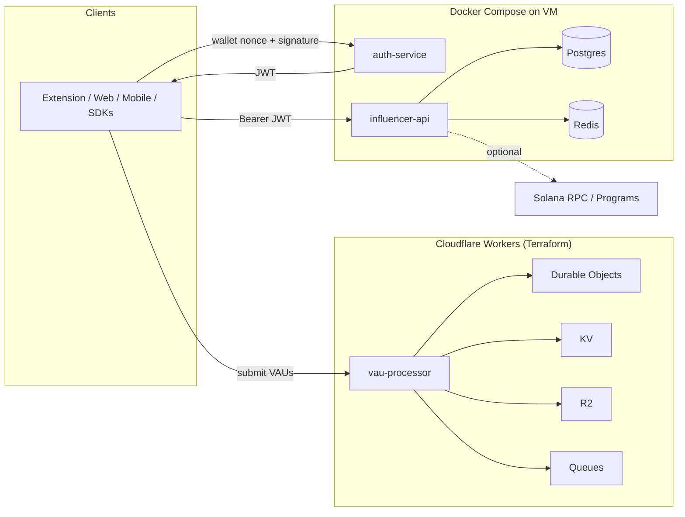

# Design: Make TWIST production-ready end-to-end

## Overview

Keep the current split architecture (Cloudflare edge + Node backend services) but make it **operationally real**: standardize identity/auth, remove mock-only behaviors from “critical path” APIs (or clearly gate them), and harden CI/CD + runtime configuration so staging and production can run deterministically on free-tier infrastructure.

## Architecture

### Component diagram (edit to match the codebase)

### Key components

- **Edge VAU ingestion (`modules/plan-2-edge/`)**: authenticate + rate limit + dedupe VAUs; emit reward/analytics messages; write audit logs.
- **Wallet auth (`services/auth-service/`)**: nonce issuance + Solana signature verification; JWT issuance.
- **Influencer API (`services/influencer-api/`)**: influencer profiles, pools, links, attribution, payouts, websockets, background jobs.
- **Shared packages (`packages/*`)**: message schemas and chain client abstraction (currently mocked).

## Data model / state

- Edge (KV/R2):
  - `vau:<vauId>` stored for dedupe (TTL).
  - `device:<deviceId>` for basic trust score inputs.
  - R2 audit logs for requests/responses.
- Backend (Postgres via TypeORM):
  - `Influencer`, `InfluencerStakingPool`, `InfluencerLink`
  - `User`, `UserStake`, `StakingReward`, `StakingHistory`
  - `ClickEvent`, `Conversion`, `Attribution`
  - `InfluencerPayout`, `InfluencerPayoutItem`, notifications

## Interfaces / APIs

- **JWT (canonical)**:
  - Issued by `auth-service` with `sub=<walletAddress>` and `walletAddress=<walletAddress>`.
  - `influencer-api` must treat wallet address as identity root and map it to `userId`/`influencerId` via DB lookup (and cache).
- **Edge VAU ingestion**:
  - Requires `Authorization: Bearer <token>` plus `X-Timestamp` and `X-HMAC-Signature` in non-development environments.
  - Returns `{ vauId, earned, trustScore, timestamp }` or a validation error.
- **Backend APIs**:
  - Writes (stake, generate link, request payout, update profile) require a valid JWT and server-derived identity (no `userId` passed by the client for auth decisions).

Errors:

- `401` for missing/invalid auth.
- `400` for validation errors (schema, bad bigint amounts).
- `429` for rate limit triggers (edge + backend).

## File-level changes

| File | Action | Purpose |
|------|--------|---------|
| `services/influencer-api/src/guards/*` | Modify | Make JWT guard behavior consistent and correctly wired |
| `services/influencer-api/src/controllers/*` | Modify | Enforce auth for writes; derive identity from JWT |
| `packages/blockchain-sdk/*` | Modify/Replace | Replace mock chain client (or clearly gate it) |
| `docker-compose.backend.yml` | Modify | Ensure production-safe defaults + migrations sequencing |
| `.github/workflows/*` | Modify | Keep gitleaks/CodeQL stable; deploy workflows stay deterministic |
| `README.md` | Modify | Keep docs honest about what is implemented vs scaffolded |

## Failure modes & error handling

- Edge KV outage → fail closed for VAU ingest or degrade to “no reward” mode → client gets `5xx` or `200` with `earned=0` (decision required).
- Queue backpressure → store VAU but delay reward processing → client still receives `200`, processing is eventual.
- Backend DB unavailable → `/ready` fails; deploy blocks; API returns `503`.
- Redis unavailable → rate limiting/caching degrades; background jobs pause; `/ready` fails.

## Edge cases

- Duplicate VAU submissions — dedupe via KV key; return `400 Duplicate VAU submission`.
- Clock skew on HMAC timestamp — allow bounded skew; reject beyond threshold.
- BigInt input parsing — validate as string, parse with `BigInt`, reject negatives/zero.

## Security & privacy

- Use **one JWT secret** across `auth-service` and `influencer-api` in each environment; rotate via environment secrets.
- Enforce **authorization at controller boundaries**: do not accept `userId`/`wallet` from client for auth decisions.
- Avoid logging request bodies containing secrets/signatures; edge audit logs must exclude headers where needed.
- Maintain least-privilege GitHub Action permissions (no PAT required; use `GITHUB_TOKEN` + environment secrets).

## Performance considerations

- Edge: keep VAU handler CPU/memory bounded; avoid synchronous R2 writes (use `waitUntil`).
- Backend: use indexes on high-cardinality lookup fields (wallet address, link code, influencer id).
- Use Redis caching for high-read endpoints (pool search, analytics), but keep correctness as source-of-truth in Postgres.

## Test strategy

Map tests back to acceptance criteria.

- **Unit**:
  - Edge auth middleware (HMAC verification + timestamp window).
  - Backend JWT claim parsing + identity mapping (wallet -> user/influencer).
- **Integration**:
  - `auth-service` nonce + verify flow.
  - `influencer-api` protected endpoints with a real JWT from `auth-service`.
  - Postgres/Redis readiness checks.
- **E2E (staging)**:
  - Submit VAU -> observe queued reward message (at minimum: queue send succeeds).
  - Register influencer -> verify email -> generate link -> track click -> track conversion -> calculate payout.

## Rollout / migration plan (if needed)

- Land changes behind staging first; keep production deploy manual.
- Validate end-to-end auth + guarded endpoints in staging.
- Cut production release after staging burn-in; document rollback steps in runbooks.
